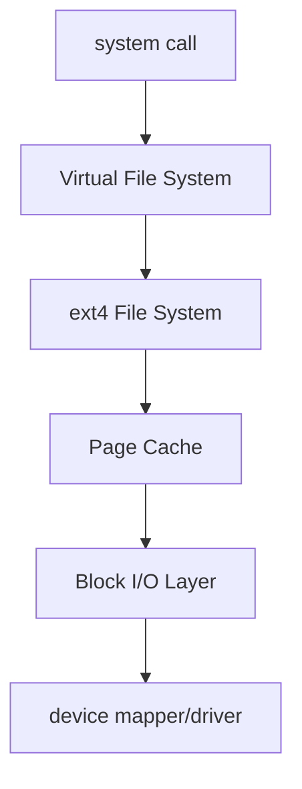

---
categories:
  - Linux
description: cgroup v2 提供了 `io.max` 控制器，讓我們可以限制特定 cgroup 對單一區塊設備（block device）的讀寫速度（BPS 或 IOPS）。今天我們要探索的問題是：`io.max` 究竟在檔案讀寫流程的哪個環節介入？它又是如何透過何種機制實現流量控制的？本篇文章將以 **Linux 核心 v6.14 版本的原始碼**為基礎，深入探討 `io.max` 在 Block I/O Layer 的完整實現原理。
tags:
  - 技術分享
  - 原始碼分析
date: 2025-09-30
title: 深入 Linux Kernel：cgroup io.max 如何在 Block Layer 中實現 I/O 限速
draft: false
---
cgroup v2 提供了 `io.max` 控制器，讓我們可以限制特定 cgroup 對單一區塊設備（block device）的讀寫速度（BPS 或 IOPS）。今天我們要探索的問題是：`io.max` 究竟在檔案讀寫流程的哪個環節介入？它又是如何透過何種機制實現流量控制的？本篇文章將以 **Linux 核心 v6.14 版本的原始碼**為基礎，深入探討 `io.max` 在 Block I/O Layer 的完整實現原理。

<!-- more -->

## **I/O 請求的旅程：從系統呼叫到 Block Layer**

首先，我們需要對 Linux 的 I/O Stack 有一個整體的了解。當我們在應用程式中使用 `write()` 這類 system call 來操作檔案時，請求會首先進入**虛擬檔案系統 (Virtual File System, VFS)** 層，呼叫 VFS 函數，如 `vfs_write` 。VFS 作為一個抽象層，提供了統一的介面，讓上層的系統呼叫無需關心底層檔案系統（如 ext4, XFS）的具體實現。

如我在[虛擬檔案系統 VFS (1) - iT 邦幫忙::一起幫忙解決難題，拯救 IT 人的一天](https://ithelp.ithome.com.tw/articles/10355372)介紹到的，檔案系統需要實現 VFS 的介面，來提供檔案系統功能。透過這樣的抽象，底層的檔案系統實現就不會被限制，也使 procs 這樣的虛擬檔案系統成為可能，是 Linux 架構中，萬物皆為檔案的重要基礎。




檔案系統的核心職責是管理檔案的組織結構、中繼資料 (metadata) 等，但它不直接與硬碟等儲存介質溝通。資料的讀寫最終需要通過 **Block I/O Layer**，由它來處理來自檔案系統的請求，並將這些請求排程、分派給對應的設備驅動程式 (device driver)。

此外，為了提升效能，檔案系統與 Block I/O Layer 之間還有一層重要的**頁面快取 (Page Cache)**，它會暫存檔案的讀寫內容，以減少昂貴的磁碟 I/O 操作次數。

所有對實體儲存設備的 I/O 操作都必須經過 Block I/O Layer。因此，`io.max` 的限制機制自然也是在這裡實現的。在 Block Layer 中，一個 I/O 請求被封裝在 `struct bio` 這個核心資料結構中，而 `submit_bio()` 則是上層向 Block Layer 提交 I/O 請求的主要入口。

## `blk_throtl_bio`: I/O 限速的入口

讓我們從 `submit_bio` 開始追蹤程式碼。

```c
// block/blk-core.c

void submit_bio(struct bio *bio)
{
	// ... 更新統計資料 ...
	if (bio_op(bio) == REQ_OP_READ) {
		task_io_account_read(bio->bi_iter.bi_size);
		count_vm_events(PGPGIN, bio_sectors(bio));
	} else if (bio_op(bio) == REQ_OP_WRITE) {
		count_vm_events(PGPGOUT, bio_sectors(bio));
	}

	bio_set_ioprio(bio);
	submit_bio_noacct(bio); // noacct = no accounting
}
EXPORT_SYMBOL(submit_bio);
```

`submit_bio` 在做了一些統計後，會呼叫 `submit_bio_noacct`。這個函數，會先對 bio request 做一些基本的驗證，然後最重要的是會呼叫 `blk_throtl_bio(bio)` 。

```c
void submit_bio_noacct(struct bio *bio)
{
	// ... 一些基本的 bio 驗證 ...
	struct block_device *bdev = bio->bi_bdev;
	struct request_queue *q = bdev_get_queue(bdev);
	blk_status_t status = BLK_STS_IOERR;
	...
	switch (bio_op(bio)) {
	case REQ_OP_READ:
		break;
	case REQ_OP_WRITE:
		if (bio->bi_opf & REQ_ATOMIC) {
			status = blk_validate_atomic_write_op_size(q, bio);
			if (status != BLK_STS_OK)
				goto end_io;
		}
		break;
	...
	default:
		goto not_supported;
	}

	// throttling 機制
	if (blk_throtl_bio(bio))
		return;
	// 放入請求佇列
	submit_bio_noacct_nocheck(bio);
	return;

not_supported:
	status = BLK_STS_NOTSUPP;
end_io:
	bio->bi_status = status;
	bio_endio(bio);
}
```

- 如果 `blk_throtl_bio()` 回傳 `true`，代表這個 `bio` 請求**已經被 I/O throttling 機制限速**，函數會直接 `return`。這個 `bio` 不會立刻被提交到設備佇列，而是會被放入一個 throttling 的待辦佇列，等待未來被重新派發。
    
- 如果回傳 `false`，代表請求未被限速，可以繼續執行 `submit_bio_noacct_nocheck()`，將 `bio` 放入設備的請求佇列中。

```c
void submit_bio_noacct_nocheck(struct bio *bio)
{
	...
	if (current->bio_list)
		bio_list_add(&current->bio_list[0], bio);
	...
}
```


`blk_throtl_bio` 實際上是 I/O 限速的總入口。讓我們看看它如何判斷一個 `bio` 是否需要被限速。

```c
static inline bool blk_throtl_bio(struct bio *bio)
{
	if (!blk_should_throtl(bio)) // 檢查是否需要啟用限速
		return false;
	return __blk_throtl_bio(bio); // 執行限速的核心邏輯
}

static inline bool blk_should_throtl(struct bio *bio)
{
	struct throtl_grp *tg = blkg_to_tg(bio->bi_blkg);
	int rw = bio_data_dir(bio);
	// ... 省略 cgroup v1 相關邏輯 ...
	/* iops limit is always counted */
	if (tg->has_rules_iops[rw]) // 是否設定了 IOPS 限制
		return true;
	if (tg->has_rules_bps[rw] && !bio_flagged(bio, BIO_BPS_THROTTLED)) // 是否設定了 BPS 限制
		return true;
	return false;
}
```

`blk_should_throtl` 的邏輯很直接：它會從 `bio` 中取得其所屬的 cgroup，並檢查該 cgroup（由 `struct throtl_grp` 表示）是否設定了 BPS (`has_rules_bps`) 或 IOPS (`has_rules_iops`) 規則。只要有任何一項規則存在，就表示這個 `bio` 需要經過限速檢查。

## **`__blk_throtl_bio`: 限速機制的檢查與排隊**

確認需要限速後，核心邏輯就交給了 `__blk_throtl_bio`。由於 cgroup 是階層式架構，一個 I/O 請求必須同時滿足從自身 cgroup 到 root cgroup 的每一層限制。

```c
// block/blk-throttle.c
bool __blk_throtl_bio(struct bio *bio)
{
	// ... 初始化變數 ...
	struct throtl_grp *tg = blkg_to_tg(bio->bi_blkg);
	bool throttled = false;

	// ...
	// 迴圈檢查從當前 cgroup 到 root cgroup 的每一層
	while (true) {
		if (tg_within_limit(tg, bio, rw)) {
			// 在限制內，累加用量並繼續檢查父 cgroup
			throtl_charge_bio(tg, bio);
			throtl_trim_slice(tg, rw);
		} else if (bio_issue_as_root_blkg(bio)) {
			// ... 特殊情況處理，例如避免優先級反轉 ...
			tg_dispatch_in_debt(tg, bio, rw);
		} else {
			// 超出限制，跳出迴圈，準備排隊
			break;
		}

		// 爬到父 cgroup
		tg = sq_to_tg(sq->parent_sq);
		if (!tg) {
			// 已到 root 且都通過，不需限速
			bio_set_flag(bio, BIO_BPS_THROTTLED);
			goto out_unlock;
		}
	}

	// 超出限制，將 bio 加入到 tg 的佇列中
	td->nr_queued[rw]++;
	throtl_add_bio_tg(bio, qn, tg);
	throttled = true;

	// 如果佇列之前是空的，則需要安排下一次的派發
	if (tg->flags & THROTL_TG_WAS_EMPTY) {
		tg_update_disptime(tg);
		throtl_schedule_next_dispatch(tg->service_queue.parent_sq, true);
	}

out_unlock:
	// ...
	return throttled;
}
```

這段程式碼的核心是一個 `while` 迴圈，它會沿著 cgroup 樹向上遍歷。在每一層：

1. 呼叫 `tg_within_limit()` 檢查當前的 `bio` 是否在超出該層 cgroup 的限制。
    
2. **如果在限制內**：呼叫 `throtl_charge_bio()` 將 `bio` 的大小或數量計入已用額度，然後繼續向上檢查父 cgroup。
    
3. **如果超出限制**：迴圈中斷，這個 `bio` 被判定需要**被限速**。它會被 `throtl_add_bio_tg()` 加入到當前 cgroup 的 `throtl` 佇列中，並設定 `throttled = true`。
    
4. 最後，`throtl_schedule_next_dispatch()` 會被呼叫，用來設定一個計時器，以便在未來某個時間點重新派發佇列中的 `bio`。

> 這邊有一個特別的處理邏輯是「避免優先級反轉」，也就是說某些 I/O 如果被 throttle 卡住，可能會導致**高優先權的流程因低優先權流程被阻塞**而卡住，如檔案系統的 metadata I/O（journal、ext4 commit block）、swap-in I/O（缺頁要讀資料進來）、fsync() 觸發的 writeback。這些 I/O 如果被延遲，會導致系統上層程式完全卡住。

```c
static inline bool bio_issue_as_root_blkg(struct bio *bio)
{
	return (bio->bi_opf & (REQ_META | REQ_SWAP)) != 0;
}

```

### **`tg_may_dispatch`：時間片與流量計算**

那麼，`tg_within_limit` 是如何判斷是否「在限制內」的呢？它內部會呼叫 `tg_may_dispatch`，這才是計算的核心。

```c
static bool tg_within_limit(struct throtl_grp *tg, struct bio *bio, bool rw)
{
	/* throtl is FIFO - if bios are already queued, should queue */
	// 簡單來說，如果前一個 request 已經被卡住了，那現在這個 request 當然也被卡住了
	if (tg->service_queue.nr_queued[rw])
		return false;

	return tg_may_dispatch(tg, bio, NULL);
}
```
Linux 的 I/O 限速是基於**時間片 (time slice)** 機制來實現的。Linux 會記錄在一個特定的時間片內，一個 cgroup 已經使用了多少 I/O 資源，並據此來判斷其使用量是否超出限制。

當一個新的 I/O 請求（bio 請求）傳入時，核心會先檢查當前請求是否仍在舊的時間片時間範圍內。如果答案是肯定的，核心會根據從該時間片開始到目前的時間，計算出此 cgroup 預期可使用的 I/O 總量，也就是 (現在時間−時間片開始時間)×cgroup 限制，然後再判斷這個新的請求是否會導致總用量超出預期值。

每次有新的請求進來，該時間片的結束時間都會被延長。相反地，如果長時間沒有任何新的請求，當前時間就會超過該時間片的結束時間，此時系統便會啟動一個新的時間片來重新計算。

```c
// block/blk-throttle.c

static bool tg_may_dispatch(struct throtl_grp *tg, struct bio *bio,
			    unsigned long *wait)
{
	bool rw = bio_data_dir(bio);
	unsigned long bps_wait = 0, iops_wait = 0, max_wait = 0;
	u64 bps_limit = tg_bps_limit(tg, rw); // 取得設定的 BPS 上限
	u32 iops_limit = tg_iops_limit(tg, rw); // 取得設定的 IOPS 上限

	// 如果沒有設定限制，直接通過
	if ((bps_limit == U64_MAX && iops_limit == UINT_MAX) ||
	    tg->flags & THROTL_TG_CANCELING) {
		if (wait)
			*wait = 0;
		return true;
	}

	// 如果上一個時間片用完了 (current time > slice end time)，就開始一個新的
	if (throtl_slice_used(tg, rw) && !(tg->service_queue.nr_queued[rw]))
		throtl_start_new_slice(tg, rw, true);
	else {
        // 否則，確保當前時間片至少還有 throtl_slice 的長度
		if (time_before(tg->slice_end[rw], jiffies + tg->td->throtl_slice))
			throtl_extend_slice(tg, rw, jiffies + tg->td->throtl_slice);
	}

    // 計算 BPS 和 IOPS 是否在當前時間片的額度內
	bps_wait = tg_within_bps_limit(tg, bio, bps_limit);
	iops_wait = tg_within_iops_limit(tg, bio, iops_limit);

    // 如果計算出的等待時間是 0，表示額度足夠
	if (bps_wait + iops_wait == 0) {
		if (wait)
			*wait = 0;
		return true;
	}

	// 如果需要等待，計算最長的等待時間
	max_wait = max(bps_wait, iops_ wait);
	if (wait)
		*wait = max_wait;
    
    // 延長時間片以包含等待時間
	if (time_before(tg->slice_end[rw], jiffies + max_wait))
		throtl_extend_slice(tg, rw, jiffies + max_wait);

	return false; // 返回 false，表示需要等待，無法立即派發
}
```

`tg_may_dispatch` 的邏輯可以總結如下：

1. 檢查當前時間片的額度是否還足以容納這個 `bio`。
    
2. 如果額度足夠，回傳 `true`，`bio` 可以立即派發。
    
3. 如果額度不足，並回傳 `false`。這邊還會計算 wait 表示要等待多少時間，不過這個值目前沒用。

```c
#define DFL_THROTL_SLICE_HD (HZ / 10)
#define DFL_THROTL_SLICE_SSD (HZ / 50)
#define MAX_THROTL_SLICE (HZ)

static int blk_throtl_init(struct gendisk *disk) 
{
	...
	if (blk_queue_nonrot(q))
		td->throtl_slice = DFL_THROTL_SLICE_SSD;
	else
		td->throtl_slice = DFL_THROTL_SLICE_HD;
	...
}

```

## 非同步派發：被限速的 I/O 何去何從？
我們已經知道，超出限制的 `bio` 會被放入一個佇列。那這些 `bio` 最終是如何被重新提交的呢？答案是透過**核心計時器 (kernel timer)** 和 **工作佇列 (workqueue)** 實現的非同步派發。

1. **設定計時器**：當 `__blk_throtl_bio` 決定要限速一個 `bio` 時，`throtl_schedule_next_dispatch` 會根據 `tg_may_dispatch` 計算出的等待時間，設定一個計時器。
    
2. **計時器觸發**：當等待時間結束後，計時器會觸發函式 `throtl_pending_timer_fn`。
    
3. **排入工作佇列**：這個函式不會直接提交 `bio`，而是將一個派發任務 (`dispatch_work`) 排入名為 `kthrotld_workqueue` 的工作佇列。
    
4. **工作執行緒派發**：`kthrotld` 這個核心執行緒會執行 `blk_throtl_dispatch_work_fn`。這個函式會從限速佇列中取出所有已經可以被派發的 `bio`，並最終呼叫 `submit_bio_noacct_nocheck` 將它們提交給設備驅動。


### **總結**

我們從 `io.max` 這個 cgroup 介面出發，一路追蹤到 Linux Block I/O Layer 的深處，完整解析了其限速機制的實現原理：

1. 當 I/O 請求透過 `submit_bio` 進入 Block Layer 時，`blk_throtl_bio` 會作為限速的入口，檢查請求所屬的 cgroup 是否設定了 `io.max` 規則。
    
2. 檢查是**階層式**的，請求必須滿足從自身到 root 的每一層 cgroup 限制。
    
3. 限速的計算基於**時間片**和**額度**。`tg_may_dispatch` 函式會判斷在當前時間片內，是否還有足夠的 BPS/IOPS 額度來處理請求。
    
4. 若額度不足，`bio` 會被暫時放入一個專屬的**限速佇列**，並透過**核心計時器**和**工作佇列**的非同步機制，在等待足夠長的時間後，被重新派發到設備佇列，從而實現精確的流量控制。
