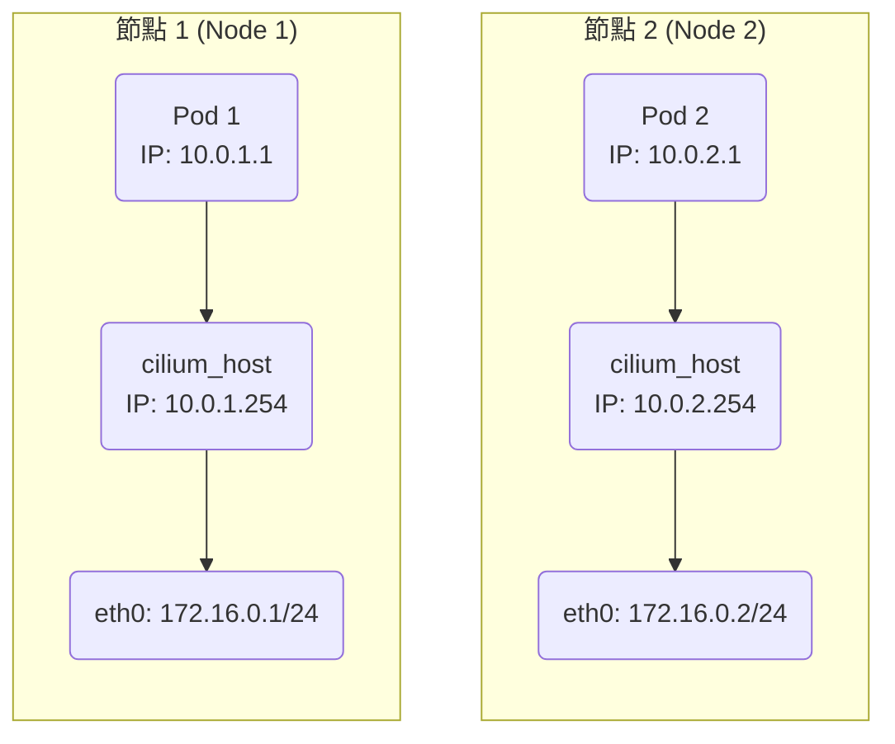
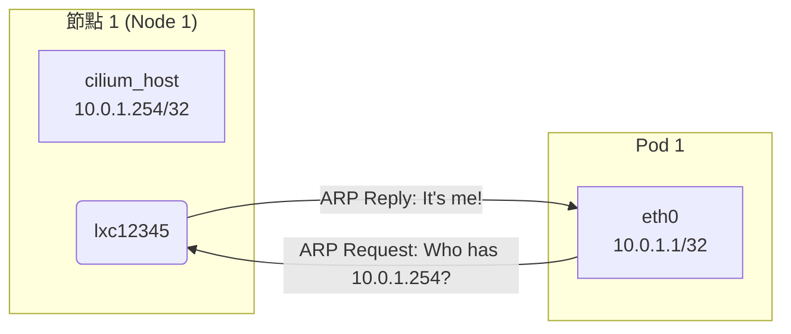
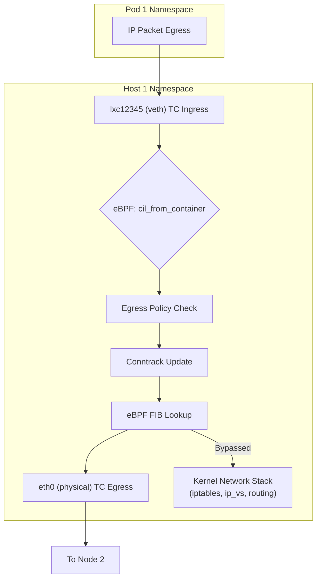
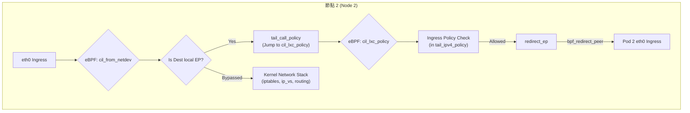

---
categories:
  - Kubernetes
description: 本文探索了 Cilium 網路架構下，pod 之間封包傳輸的 kernel 處理路徑，分析 Cilium 如何透過 eBPF 跳過傳統的 network stack 並轉發封包
tags:
  - 原始碼分析
  - Kubernetes
  - eBPF
  - CNI
date: 2025-08-23
title: Cilium 跨節點 Pod to Pod 封包傳輸路徑解析
draft: false
---
Cilium 藉由 eBPF 技術，巧妙地繞過了 Linux Kernel 傳統的 network stack 來加速封包傳輸，然而，這也意味著封包的處理路徑不再是我們所熟悉的 netfilter 或 IPVS，封包可能在更早的階段就被 Cilium 截獲並轉發到其他網路介面，使得整體的網路行為變得陌生且難以追蹤。

因此，今天我們要來深入探討一個核心問題：在 Cilium v1.17.3 版本中，當啟用 `kube-proxy replacement` 和 `native routing` 模式時，一個封包從節點 A 的 Pod 出發，到節點 B 的 Pod，究竟會經過哪些 eBPF 程式？又是在哪個環節繞過了 kernel network stack？

<!-- more -->

### 環境設置

在開始追蹤封包之前，我們先建立一個用於本次分析的環境。我們使用 `kind` 搭建一個雙節點的 Kubernetes 叢集，並且為了讓 Cilium 完全接管網路，需要關閉預設的 CNI 和 `kube-proxy`。

**Kind 叢集設定：**

```bash
kind create cluster --config - <<EOF
kind: Cluster
apiVersion: kind.x-k8s.io/v1alpha4
nodes:
- role: control-plane
- role: control-plane
networking:
  disableDefaultCNI: true
  kubeProxyMode: none
EOF

# 移除 control-plane 的 taint，讓 Pod 可以被調度上去
kubectl taint nodes kind-control-plane node-role.kubernetes.io/control-plane:NoSchedule-
kubectl taint nodes kind-control-plane2 node-role.kubernetes.io/control-plane:NoSchedule-
```

**Cilium Helm Values 設定 (`cilium.yaml`)：**

```yaml
# 讓 Cilium 完全取代 kube-proxy
kubeProxyReplacement: true
# 使用原生路由模式，不進行封裝
routingMode: native
autoDirectNodeRoutes: true
# 指定 Pod 的 CIDR
ipv4NativeRoutingCIDR: "10.0.0.0/16"

# 其他相關設定
k8sServiceHost: kind-control-plane
k8sServicePort: 6443
bpf:
  masquerade: true
debug:
  enabled: true
  verbose: "datapath"
```

**安裝 Cilium：**

```bash
helm install cilium cilium/cilium --version 1.17.3 -f cilium.yaml -n kube-system
```

為了方便後續討論，我們假設環境中的 IP 分配如下（實際環境可能不同）：

  * **節點 IP**: 節點 1 (`172.16.0.1/24`)，節點 2 (`172.16.0.2/24`)
  * **Pod CIDR**: 節點 1 (`10.0.1.0/24`)，節點 2 (`10.0.2.0/24`)
  * **`cilium_host` 介面 IP**: 節點 1 (`10.0.1.254/24`)，節點 2 (`10.0.2.254/24`)
  * **Pod IP**: Pod 1 (`10.0.1.1`)，Pod 2 (`10.0.2.1`)



### 從 ARP 開始

讓我們先從 Pod 1 的視角出發，看看它的網路設定：

```bash
# 在 Pod 1 內執行 ip addr
6: eth0@if7: <...>
    inet 10.0.1.1/32 scope global eth0

# 在 Pod 1 內執行 ip route
default via 10.0.1.254 dev eth0
10.0.1.254 dev eth0 scope link
```

可以看到，Pod 的 IP 是一個 `/32` 的位址，所有的對外流量都會透過 `10.0.1.254` 這個 gateway，也就是 Host 上的 `cilium_host` 介面。根據標準的 Linux 網路行為，當 Pod 1 要傳送封包到 Pod 2 (`10.0.2.1`) 時，它首先需要知道 gateway `10.0.1.254` 的 MAC address。因此，它會發送一個 ARP request。

#### 消失的 proxy\_arp 與 eBPF ARP Responder

在 Host 1 上，我們可以看到與 Pod 1 `eth0` 配對的 `veth` 介面，例如 `lxc12345`。當 Pod 發出 ARP request 時，這個 `lxc12345` 介面會回應自己的 MAC address。



這就奇怪了，從 host 可以發現 `lxc12345` 介面本身並沒有 `10.0.1.254` 這個 IP，那他怎麼會回應呢？在傳統的 CNI（如 Calico）中，這通常是透過啟用 `proxy_arp` 來實現的，當介面啟用 `proxy_arp`，如果該 IP 可從本地路由到達，Linux 就會回應本介面的 mac。然而，當我們檢查 Cilium 環境下的設定時，會發現 `proxy_arp` 並未開啟。

```bash
cat /proc/sys/net/ipv4/conf/*/proxy_arp
# 輸出全為 0
```

答案當然就在 eBPF。Cilium 透過在 `veth` 介面的 `tc ingress` hook 點掛載 eBPF 程式，實作了一個高效的 ARP Responder。我們可以使用 `bpftool` 來驗證，在 `lxc12345` 介面上掛載了 `cil_from_container` 這個 eBPF 程式。

這個程式的原始碼位於 `bpf/bpf_lxc.c`，其邏輯相當直接：

```c
// bpf/bpf_lxc.c

__section_entry
int cil_from_container(struct __ctx_buff *ctx)
{
    __u16 proto;
    // ...
    switch (proto) {
    // ...
#if defined(ENABLE_ARP_RESPONDER)
    case bpf_htons(ETH_P_ARP):
        // 遇到 ARP 封包，跳轉到 ARP 處理程式
        ret = tail_call_internal(ctx, CILIUM_CALL_ARP, &ext_err);
        break;
#endif
    // ...
    }
}

__section_tail(CILIUM_MAP_CALLS, CILIUM_CALL_ARP)
int tail_handle_arp(struct __ctx_buff *ctx)
{
	union macaddr mac = THIS_INTERFACE_MAC;
    // ...
    // 直接用 veth 介面自己的 MAC address 回應 ARP request
    return arp_respond(ctx, &mac, tip, &smac, sip, 0);
}
```

當來自 Pod 的 ARP 封包進入 `lxc12345` 介面時，`cil_from_container` 會攔截它，並透過 `tail_call` 跳轉到 `tail_handle_arp`。這個函數會直接偽造一個 ARP reply，告訴 Pod gateway 的 MAC address，這邊透過 THIS_INTERFACE_MAC 定義，當然就是 `lxc12345` 的 MAC address。整個過程完全在 eBPF 中完成，**完全沒有進入 Host 的核心網路堆疊**，極大地提升了效率。

### IP 封包的 Egress 路徑

在拿到 gateway 的 MAC address 後，Pod 1 終於可以發出 IP 封包了。這個封包同樣會被 `lxc12345` 介面上的 `cil_from_container` 程式攔截。

這次，因為封包類型是 `ETH_P_IP`，eBPF 程式會走另一條更複雜的處理路徑。經過一系列的 `tail_call`（主要用於處理 conntrack 和 service 轉譯），最終會執行到 `handle_ipv4_from_lxc` 這個核心函數。

```c
// bpf/bpf_lxc.c

static __always_inline int handle_ipv4_from_lxc(struct __ctx_buff *ctx, ...)
{
    // ... (Network Policy, Conntrack 處理)
#if defined(TUNNEL_MODE)
...
#end
    // 因為我們是 native routing 模式，會進入這個 block
    if (is_defined(ENABLE_HOST_ROUTING)) {
        int oif = 0;

        // 核心步驟：在 eBPF 中查詢核心路由表
        ret = fib_redirect_v4(ctx, ETH_HLEN, ip4, false, false, ext_err, &oif);
        
        // ...
        return ret;
    }
    // ...
}
```

`handle_ipv4_from_lxc` 是一個龐大而複雜的函數，它負責執行 Egress Network Policy、更新 conntrack 條目、處理 NodePort 等。在我們的案例中，最關鍵的一步是路由處理。因為我們啟用了 `native routing` 模式，Tunnel mode 的部分會被跳過，程式會進入 `ENABLE_HOST_ROUTING` 的邏輯分支，並呼叫 `fib_redirect_v4`。

> 這邊有個小陷阱 `ENABLE_HOST_ROUTING` 不是 native routing mode 的意思，而是關閉 legacy routing mode，legacy routing mode 是舊的、不透過 ebpf 而是交給 kernel 處理的模式，所以我們當然不會開。

```c
// bpf/lib/fib.h

static __always_inline int
fib_redirect_v4(struct __ctx_buff *ctx, ...)
{
    // ...
    // 呼叫 bpf_fib_lookup helper function
    fib_result = fib_lookup_v4(ctx, &fib_params, ip4->saddr, ip4->daddr, 0);
    // ...
    // 根據查詢結果，直接重導向封包
    return fib_do_redirect(ctx, ...);
}
```

`fib_lookup_v4` 內部會呼叫 `bpf_fib_lookup` 這個 eBPF helper function，它允許 eBPF 程式**直接查詢 Linux 核心的 FIB (Forwarding Information Base，即路由表)**。查詢結果會告訴 eBPF，要到達 `10.0.2.1`，應該從 Host 的 `eth0` 介面發出。

接著，`fib_do_redirect` 會呼叫 `bpf_redirect` helper，將封包**直接塞到 `eth0` 介面的 egress queue 中**。

至此，封包已經完成了在節點 1 的旅程。值得注意的是，從 `veth` 介面進來後，封包經過 eBPF 處理（策略、路由），然後就被直接送到了 `eth0` 介面，**完全繞過了 Host 核心的 `iptables/netfilter` 等整個 TCP/IP 堆疊**。這就是 Cilium 高效能的秘密。



### 封包抵達節點 2

封包穿過實體網路，抵達節點 2 的 `eth0` 介面，觸發了掛載在 `eth0` 上的 `tc ingress` eBPF 程式 `cil_from_netdev`。

```c
// bpf/bpf_host.c

__section_entry
int cil_from_netdev(struct __ctx_buff *ctx)
{
    // ...
    // 經過一系列 tail_call 處理 conntrack
    // 最終會呼叫到 handle_ipv4_cont
    // ...
}
```

這個程式的處理流程與 egress 路徑類似，經過一系列 conntrack 檢查後，會呼叫到 `handle_ipv4_cont`。

```c
// bpf/bpf_host.c

static __always_inline int
handle_ipv4_cont(struct __ctx_buff *ctx, ...)
{
    // ...
    // 查詢目的 IP 是否為本機的 endpoint
    ep = lookup_ip4_endpoint(ip4);
    if (ep) {
        // 是本機 Pod，進行本地交付
        return ipv4_local_delivery(ctx, ...);
    }
    // ...
}
```

`lookup_ip4_endpoint` 會在 BPF Map (`cilium_lxc`) 中查詢目的 IP `10.0.2.1`。因為這個 IP 屬於節點 2 上的 Pod 2，查詢會成功，並回傳 Pod 2 的 endpoint 資訊。接著，程式會呼叫 `ipv4_local_delivery`。

#### 巧妙的跳轉：`tail_call_policy`

`ipv4_local_delivery` 裡有一個非常巧妙的設計，它並不是直接轉發封包，而是進行了一次特殊的 `tail_call`

```c
// bpf/lib/l3.h

static __always_inline int
ipv4_local_delivery(struct __ctx_buff *ctx, ...)
{
    // ...
    // 跳轉到目標 Pod 對應的 eBPF 程式來執行 Ingress Policy
    ret = tail_call_policy(ctx, ep->lxc_id);
    // ...
}
```

`tail_call_policy` 會根據 Pod 2 的 endpoint ID，從一個特殊的 BPF map (`cilium_call_policy`) 中找到與 Pod 2 `veth` 介面（例如 `lxc67890`）關聯的 `cil_lxc_policy` (bpf/bpf_lxc.c) eBPF 程式，並將執行權跳轉過去。

```c
// bpf/bpf_lxc.c

/*
 * 處理進入 endpoint 的封包的 policy 決策...
 * 這個程式會被 bpf_host, bpf_overlay, 或 bpf_lxc 中的
 * ipv{4,6}_local_delivery 透過 tail call 呼叫。
 */
__section_entry
int cil_lxc_policy(struct __ctx_buff *ctx)
{
    // ...
    switch (proto) {
#ifdef ENABLE_IPV4
    case bpf_htons(ETH_P_IP):
        // 進行 conntrack 查詢後，再 tail call 到 tail_ipv4_policy
        ret = invoke_tailcall_if(...,
                     CILIUM_CALL_IPV4_CT_INGRESS_POLICY_ONLY,
                     tail_ipv4_ct_ingress_policy_only, &ext_err);
        break;
#endif
    // ...
    }
}
```

`cil_lxc_policy` 是會處理準備進入本地 Pod 流量的，根據封包協定（IPv4/IPv6），先進行 conntrack 查詢，然後再將封包 `tail_call` 給真正的策略處理函數 `tail_ipv4_policy`。

`tail_ipv4_policy` 決定是否將封包交付給目標 Pod。

```c
// bpf/bpf_lxc.c

__declare_tail(CILIUM_CALL_IPV4_TO_LXC_POLICY_ONLY)
static __always_inline
int tail_ipv4_policy(struct __ctx_buff *ctx)
{
    // ...
    // 呼叫 ipv4_policy 執行 Ingress 策略檢查
    ret = ipv4_policy(ctx, ip4, src_label, &tuple, &ext_err,
                      &proxy_port, from_tunnel);
    switch (ret) {
    // ...
    case CTX_ACT_OK: // 策略允許通過
        if (do_redirect)
            // 呼叫 redirect_ep 進行最終的封包重導向
            ret = redirect_ep(ctx, THIS_INTERFACE_IFINDEX, from_host,
                              from_tunnel);
        break;
    // ...
    }
    // ...
}
```

`ipv4_policy` 根據來源 Pod 的 security identity 和目標 Pod 的 identity，檢查 Ingress 策略是否允許此流量，以及是否需要重導向到 L7 proxy (envoy)。

對我們而言，程式會呼叫 `redirect_ep` 函數來重導向封包，它內部使用 `bpf_redirect_peer` 這個特殊的 helper function，將封包**直接送進 `veth` pair 的另一端**，也就是 Pod 2 內的 `eth0` 介面。
```c
// bpf/lib/lxc.h

static __always_inline int redirect_ep(struct __ctx_buff *ctx, ...)
{
	...
    // 使用 bpf_redirect_peer 進行跨 namespace 的高效重導向
    return ctx_redirect_peer(ctx, ifindex, 0);
}
```

`bpf_redirect_peer` 的強大之處在於，它可以跨 network namespace 傳遞封包，徹底繞過了 `veth` 驅動層和核心的路由決策。



### 總結

透過這次的追蹤，我們揭開了 Cilium 在 `native routing` 模式下跨節點通訊的神祕面紗。其核心是利用 eBPF 在網路路徑的關鍵節點（`tc ingress/egress`）進行攔截和處理，實現了一條繞過核心網路堆疊的快速路徑：

1.  **高效 ARP**：Pod 發出的 ARP request 由 eBPF 直接回應。
2.  **Egress 核心繞道**：在來源節點，eBPF 程式在執行完策略後，直接查詢核心路由表（FIB），並透過 `bpf_redirect` 將封包送至實體網卡，完全繞過 `iptables` 。
3.  **Ingress 核心繞道**：在目的節點，eBPF 程式識別出本地 Pod 流量後，透過 `tail_call` 機制跳轉到對應 Pod 的策略程式，並最終使用 `bpf_redirect_peer` 跨 namespace 將封包直接注入 Pod，再次繞過了核心網路堆疊及 veth driver。

正是這一系列精巧的 eBPF 設計，讓 Cilium 提供極致的網路效能。希望這篇文章能幫助你更深入地理解 Cilium 的運作原理。 