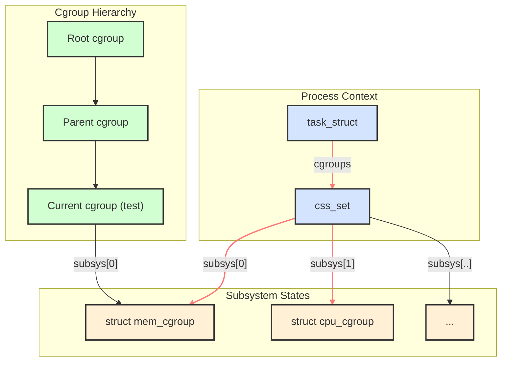
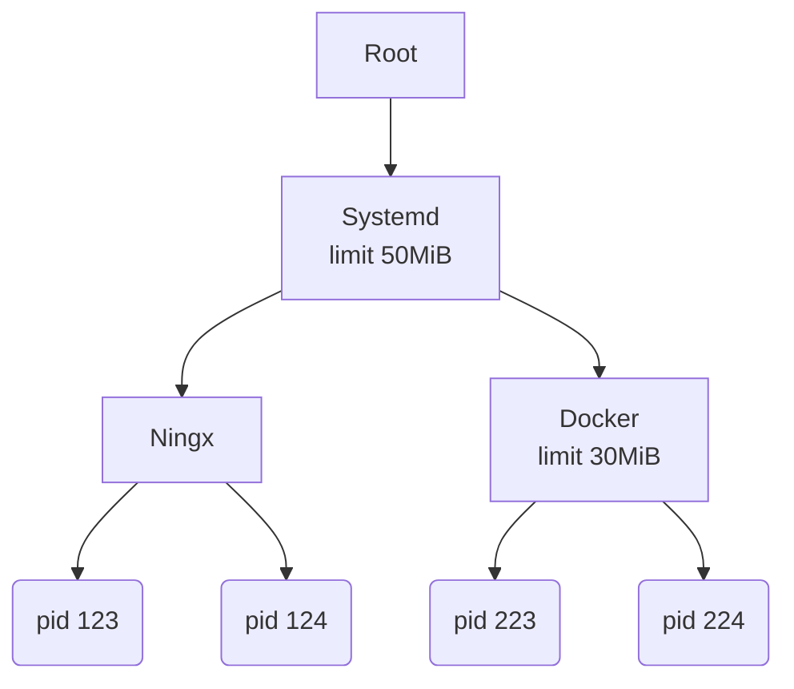
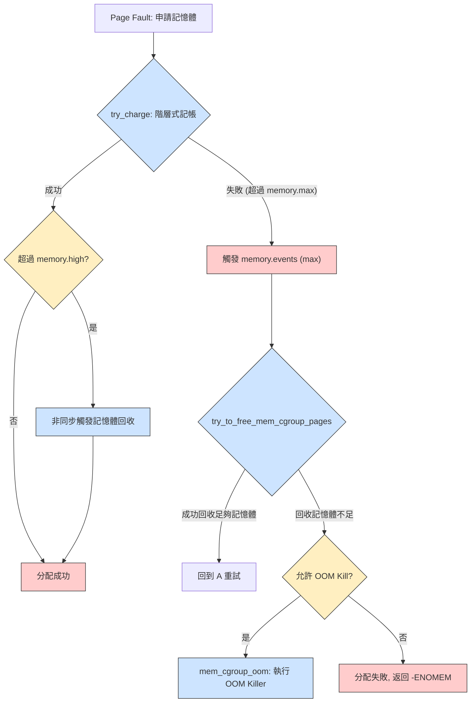
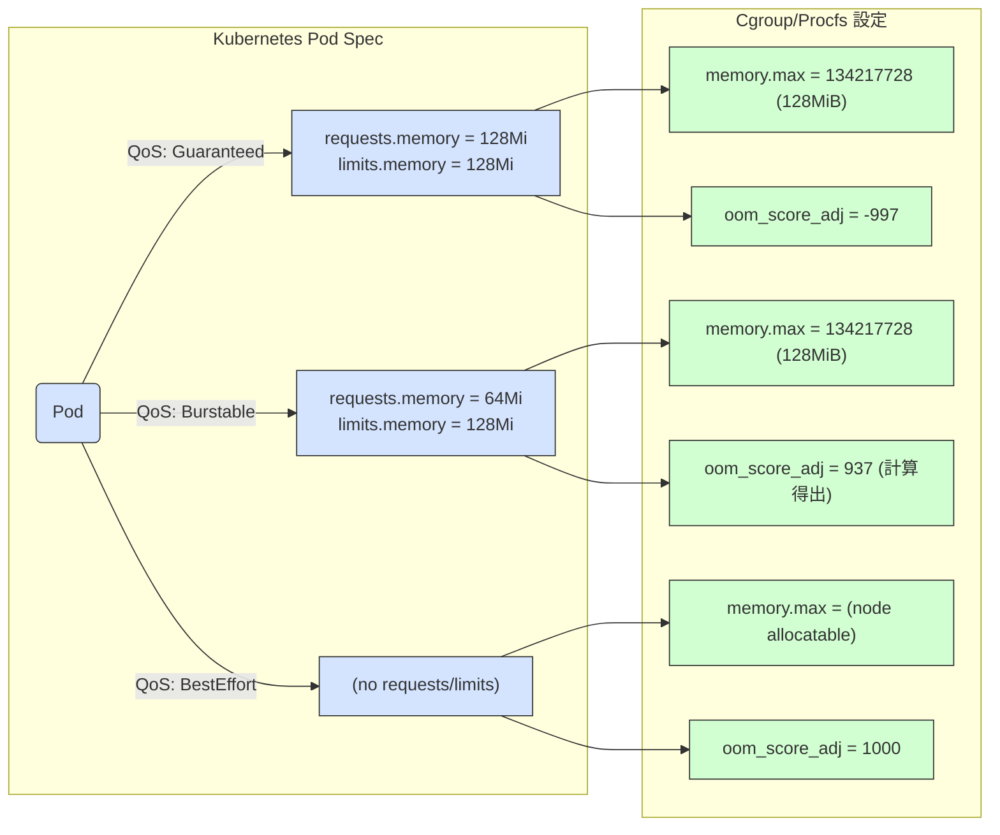

---
categories:
  - Linux
description: 在 Kubernetes 中，我們會為容器指定 `memory` 的 `limits` 與 `requests`，這些限制又會被轉換成 Linux cgroup 的設定。Linux 核心是如何實現記憶體限制的？當一個行程的記憶體申請超過上限時，又是什麼機制觸發了 OOM (Out Of Memory) Kill？本篇文章深入探索 Linux 核心的記憶體 cgroup 管理機制，以 **Linux 核心 v6.15 版本的原始碼**為基礎，從 cgroup v2 memory controller 的使用者介面出發，一步步向下追蹤，詳細解析其核心資料結構 (`struct mem_cgroup`, `struct page_counter`)、階層式的記憶體「收費」(charge) 機制、記憶體回收與 OOM Kill 的完整觸發路徑。最終，我們將這一切與 Kubernetes 的記憶體資源配置 (`limits` 與 QoS) 聯繫起來，徹底打通從 K8s YAML 設定到 Kernel 底層實現的任督二脈。
tags:
  - 技術分享
  - 原始碼分析
  - Kubernetes
date: 2025-06-25
title: 解析 Linux Cgroup V2 的 memory control 實現
draft: false
---
在 Kubernetes 中，我們會為容器指定 `memory` 的 `limits` 與 `requests`，這些限制又會被轉換成 Linux cgroup 的設定。Linux 核心是如何實現記憶體限制的？當一個行程的記憶體申請超過上限時，又是什麼機制觸發了 OOM (Out Of Memory) Kill？ 

本篇文章深入探索 Linux 核心的記憶體 cgroup 管理機制，以 **Linux 核心 v6.15 版本的原始碼**為基礎，從 cgroup v2 memory controller 的使用者介面出發，一步步向下追蹤，詳細解析其核心資料結構 (`struct mem_cgroup`, `struct page_counter`)、階層式的記憶體「收費」(charge) 機制、記憶體回收與 OOM Kill 的完整觸發路徑。最終，我們將這一切與 Kubernetes 的記憶體資源配置 (`limits` 與 QoS) 聯繫起來，徹底打通從 K8s YAML 設定到 Kernel 底層實現的任督二脈。

<!-- more -->

## **cgroup v2 memory controller 的使用方式**

cgroup v2 提供了豐富的檔案介面來管理和監控記憶體資源。要使用 memory cgroup，首先需要建立一個 cgroup：

```bash
mkdir /sys/fs/cgroup/test
```

建立後，該目錄下會自動生成一系列與記憶體相關的控制檔案，我們可以透過這些檔案來配置和查看 cgroup 的記憶體狀態：

```bash
ls /sys/fs/cgroup/test | grep memory
memory.current
memory.events
memory.events.local
memory.high
memory.low
memory.max
memory.min
memory.numa_stat
memory.oom.group
memory.peak
memory.pressure
memory.reclaim
memory.stat
memory.swap.current
memory.swap.events
memory.swap.high
memory.swap.max
memory.swap.peak
memory.zswap.current
memory.zswap.max
memory.zswap.writeback
```

以下是這些檔案的詳細說明：

- **`memory.current`** (唯讀): 顯示此 cgroup 及其所有後代 cgroup 目前使用的總記憶體量（包含檔案快取和匿名記憶體），單位為位元組 (Bytes)。
- **`memory.events`** (唯讀): 包含此 cgroup 及其後代 cgroup 累計的記憶體事件計數，例如 `low` (記憶體使用量低於 `memory.low` 的次數)、`high` (記憶體使用量超過 `memory.high` 並觸發記憶體回收的次數)、`max` (記憶體使用量達到 `memory.max` 上限的次數)、`oom` (發生 OOM 的次數) 和 `oom_kill` (因 OOM killer 被殺死的次數)，以及設定 `memory.oom.group` 讓所有 process 一起被 OOM Kill 殺掉的次數 `oom_group_kill`。
    
    ```bash
    cat /sys/fs/cgroup/kubepods/memory.events
    low 0
    high 0
    max 0
    oom 0
    oom_kill 0
    oom_group_kill 0
    ```
    
- **`memory.events.local`** (唯讀): 類似於 `memory.events`，但只包含此 cgroup 本身的記憶體事件計數，不包含其後代 cgroup。
- **`memory.max`** (可讀寫): 設定記憶體使用的硬上限。cgroup 及其後代的總記憶體使用量不允許超過此值，若超過且無法回收足夠記憶體，可能觸發 OOM killer。單位為位元組，可寫入 `max` 表示不限制。
- **`memory.high`** (可讀寫): 設定記憶體使用的高水位線。當 cgroup 記憶體用量超過此值時，核心會開始進行記憶體回收。單位為位元組，設定為 `0` 則禁用此機制。
- **`memory.low`** (可讀寫): 設定記憶體使用的低水位線。當 cgroup 記憶體用量低於此值時，核心會盡力保護其記憶體不被回收。單位為位元組，設定為 `0` 則禁用此機制。
- **`memory.min`** (可讀寫): 設定記憶體使用的最低保證。核心會盡力確保 cgroup 記憶體使用量不低於此值，即使系統記憶體壓力大也會嘗試滿足。單位為位元組，設定為 `0` 則禁用此機制。這與 `memory.low` 類似，但 `memory.min` 提供了更強的保證，在系統記憶體壓力極大時，仍會嘗試滿足此下限。如果多個 cgroup 的 `memory.min` 總和超過系統可用記憶體，則按比例分配。
- **`memory.numa_stat`** (唯讀): 提供此 cgroup 在每個 NUMA 節點上的記憶體使用統計。
    
	```bash
    cat /sys/fs/cgroup/kubepods/memory.numa_stat
    anon N0=38768640
    file N0=136495104
    kernel_stack N0=442368
    pagetables N0=733184
    sec_pagetables N0=0
    shmem N0=0
    file_mapped N0=117633024
    file_dirty N0=0
    file_writeback N0=0
    swapcached N0=0
    anon_thp N0=0
    file_thp N0=0
    shmem_thp N0=0
    inactive_anon N0=10817536
    active_anon N0=27951104
    inactive_file N0=31703040
    active_file N0=104792064
    unevictable N0=0
    slab_reclaimable N0=601576
    slab_unreclaimable N0=831064
    workingset_refault_anon N0=0
    workingset_refault_file N0=0
    workingset_activate_anon N0=0
    workingset_activate_file N0=0
    workingset_restore_anon N0=0
    workingset_restore_file N0=0
    workingset_nodereclaim N0=0
	```
    
- **`memory.oom.group`** (可讀寫): 控制 OOM killer 的行為。設定為 `0` (預設) 時，OOM killer 只殺死觸發 OOM 的程序。設定為 `1` 時，OOM killer 會殺死 cgroup 內所有程序。
- **`memory.peak`** (唯讀，可寫入 `0` 重置): 顯示此 cgroup 自建立或上次重置以來的記憶體使用量歷史最高峰值。單位為位元組。
- **`memory.pressure`** (唯讀): 提供記憶體壓力指標，衡量因記憶體不足導致的性能損失。avg10, avg60, avg300 分別表是過去 10, 60, 300 秒，有百分之幾的時間觸發記憶體回收操作或 OOM Kill，total 則是累進時間。some 跟 full 則是代表是所有一部份的 process 還是所有的 process 都受到影響。[詳細介紹](https://facebookmicrosites.github.io/psi/docs/overview.html#pressure-metric-definitions)

    ```Bash
    cat /sys/fs/cgroup/kubepods/memory.pressure
    some avg10=0.00 avg60=0.00 avg300=0.00 total=0
    full avg10=0.00 avg60=0.00 avg300=0.00 total=0
    ```
    
- **`memory.reclaim`** (可寫入): 觸發介面，向此檔案寫入正整數可手動觸發 cgroup 的記憶體回收。單位為位元組。
- **`memory.stat`** (唯讀): 提供 cgroup 詳細記憶體使用統計資訊。內容比 `memory.current` 更豐富，包括 `anon`(匿名記憶體)、`file` (檔案快取記憶體)、`kernel_stack` (核心堆疊) 等。這些統計值僅針對此 cgroup 本身，不遞迴包含後代。

剩下帶有 `swap` 跟 `zswap` 的，與上面所介紹的相似，只是是針對 `swap` 和 `zswap`。`swap` 大家都知道是使用硬碟來暫存記憶體資料的技術，zswap 則是 linux 的記憶體壓縮功能，會把沒用到的 page 壓縮存回記憶體裡面，減少 swap 操作需要的昂貴硬碟 IO 操作。

## **cgroup 架構**

在了解完 cgroup memory controller 的使用者介面後，為了深入理解這些檔案背後的運作機制，我們必須先探討 cgroup 在 Linux 核心中的基礎架構，以及它如何將行程與各個資源子系統連結起來。

cgroup 的核心是一個階層式的結構。每個 cgroup 實體都由 `struct cgroup` 表示，它透過 `subsys` 陣列關聯到所有已啟用的子系統（例如 memory、cpu 等）。每個子系統都有其對應的結構體（例如 `struct mem_cgroup`），這些結構體都繼承自 `struct cgroup_subsys_state`。



在行程方面，每個 `task_struct`（代表一個行程）都包含一個 `cgroups` 指標，指向一個 `css_set` 結構體。`css_set`則包含一系列 `cgroup_subsys_state` 指標，這些指標分別指向該行程所屬的每個 cgroup 子系統的狀態實例。這使得行程能夠快速查詢和管理其在各個 cgroup 中的資源使用情況。

> cgroup_subsys_state 類似繼承的概念可以參考 [小試身手 - Double Linked List - iT 邦幫忙::一起幫忙解決難題，拯救 IT 人的一天](https://ithelp.ithome.com.tw/articles/10352337)對 `container_of`的介紹。

```c
// include/linux/cgroup-defs.h
struct cgroup {
	// 指向所有子系統的陣列
    struct cgroup_subsys_state *subsys[CGROUP_SUBSYS_COUNT];
}

// include/linux/memcontrol.h
// memory 子系統的實現
struct mem_cgroup {
	// 類似繼承的概念
	struct cgroup_subsys_state css;
	...
}

// include/linux/sched.h
// 行程、執行緒的物件
struct task_struct {
...
#ifdef CONFIG_CGROUPS
	/* Control Group info protected by css_set_lock: */
	// 指向到 Cgroup SubSystem SET
	struct css_set __rcu		*cgroups;
	/* cg_list protected by css_set_lock and tsk->alloc_lock: */
	struct list_head		cg_list;
#endif
...
}

// include/linux/cgroup-defs.h
struct css_set {
	/*
	 * Set of subsystem states, one for each subsystem. This array is
	 * immutable after creation apart from the init_css_set during
	 * subsystem registration (at boot time).
	 */
	struct cgroup_subsys_state *subsys[CGROUP_SUBSYS_COUNT];
...
}
```

## **memory cgroup**
在理解了整體的 cgroup 階層式架構後，我們現在可以將焦點深入到 `memory` 子系統，看看它是如何透過 `struct mem_cgroup` 這個核心結構來實現資源的精確追蹤與控制。

### **基本結構**

`struct mem_cgroup` 是 memory cgroup 的核心結構，它內部主要透過 `struct page_counter` 來追蹤記憶體使用量和設定限制。`page_counter` 以記憶體頁 (page) 為單位進行計數。

```c
// include/linux/memcontrol.h
struct mem_cgroup {
...
	struct page_counter memory;		/* Both v1 & v2 */

	union {
		struct page_counter swap;	/* v2 only */
		struct page_counter memsw;	/* v1 only */
	};
...
}
```

`struct page_counter` 包含了多個重要欄位：

- `usage`: 當前 cgroup 的記憶體使用量。
- `failcnt`: 在 cgroup v1 中用於追蹤記憶體分配失敗次數。
- `min`, `low`, `high`, `max`: 對應 cgroup 記憶體限制設定的具體數值。
- `parent`: 指向父 cgroup 的 `page_counter`，這對於階層式計費至關重要。

> 需注意，這邊記錄的單位都是 Page 不是 bytes

```c
struct page_counter {
	/*
	 * Make sure 'usage' does not share cacheline with any other field in
	 * v2. The memcg->memory.usage is a hot member of struct mem_cgroup.
	 */
	atomic_long_t usage;
	unsigned long failcnt; /* v1-only field */

	CACHELINE_PADDING(_pad1_);

	/* effective memory.min and memory.min usage tracking */
	unsigned long emin;
	atomic_long_t min_usage;
	atomic_long_t children_min_usage;

	/* effective memory.low and memory.low usage tracking */
	unsigned long elow;
	atomic_long_t low_usage;
	atomic_long_t children_low_usage;

	unsigned long watermark;
	/* Latest cg2 reset watermark */
	unsigned long local_watermark;

	/* Keep all the read most fields in a separete cacheline. */
	CACHELINE_PADDING(_pad2_);

	bool protection_support;
	bool track_failcnt;
	unsigned long min;
	unsigned long low;
	unsigned long high;
	unsigned long max;
	struct page_counter *parent;
} ____cacheline_internodealigned_in_smp;
```

### **cgroup 的建立**

當我們透過 `mkdir /sys/fs/cgroup/test` 建立一個新的 cgroup 目錄時，無論是 cgroup v1 還是 v2，都會觸發核心中的 `cgroup_mkdir` 函數。

```c
// kernel/cgroup/cgroup-v1.c
struct kernfs_syscall_ops cgroup1_kf_syscall_ops = {
	.rename			= cgroup1_rename,
	.show_options		= cgroup1_show_options,
	.mkdir			= cgroup_mkdir, // 註冊 cgroupv1 對 cgroupfs mkdir 操作的處理函數
	.rmdir			= cgroup_rmdir,
	.show_path		= cgroup_show_path,
};

// kernel/cgroup/cgroup.c
static struct kernfs_syscall_ops cgroup_kf_syscall_ops = {
	.show_options		= cgroup_show_options,
	.mkdir			= cgroup_mkdir, // 註冊 cgroupv2 對 cgroupfs mkdir 操作的處理函數
	.rmdir			= cgroup_rmdir,
	.show_path		= cgroup_show_path,
};
```
> 因為現在逐漸轉向到 cgroup v2 是主體，所以如果是 v1 的函數會帶有 cgroup1 字樣，如果直接寫 cgroup 不是通用就是 cgroupv2 專用的。

`cgroup_mkdir` 函數會執行以下關鍵步驟：

1. 取得父 cgroup 的 cgroup 物件。
2. 呼叫 `cgroup_create` 建立新的 cgroup 物件 (`struct cgroup`)。
3. 呼叫 `cgroup_apply_control_enable` 啟用 cgroup 中的各個子系統。
```c
// cgroup/cgroup.c
int cgroup_mkdir(struct kernfs_node *parent_kn, const char *name, umode_t mode)
{
 ...
 // 從 cgroupfs 物件取得 cgroup 物件
 parent = cgroup_kn_lock_live(parent_kn, false);

 cgrp = cgroup_create(parent);

 cgroup_apply_control_enable(cgrp); // 初始化所有 cgroup 子系統
 ...
}

// cgroup/cgroup.c
static int cgroup_apply_control_enable(struct cgroup *cgrp)
{
 ...
 cgroup_for_each_live_descendant_pre(dsct, d_css, cgrp) {
  for_each_subsys(ss, ssid) { // iterace 每個子系統
   struct cgroup_subsys_state *css = cgroup_css(dsct, ss);
   css = css_create(dsct, ss);
   ...
  }
 }
 return 0;
}

static struct cgroup_subsys_state *css_create(struct cgroup *cgrp,
					      struct cgroup_subsys *ss)
{
	...
	css = ss->css_alloc(parent_css);
	...
	return css;
	...
}
```

在 `cgroup_apply_control_enable` 內部，對於每個啟用的子系統，核心會呼叫其 `css_alloc` 函數來初始化對應的子系統狀態物件。對於 memory 子系統而言，這個函數是 `mem_cgroup_css_alloc`。


```c
// mm/memcontrol.c
struct cgroup_subsys memory_cgrp_subsys = {
	.css_alloc = mem_cgroup_css_alloc, // memory 子系統註冊的 css_alloc 處理函數
	.css_online = mem_cgroup_css_online,
	.css_offline = mem_cgroup_css_offline,
	.css_released = mem_cgroup_css_released,
	.css_free = mem_cgroup_css_free,
	.css_reset = mem_cgroup_css_reset,
	.css_rstat_flush = mem_cgroup_css_rstat_flush,
	.attach = mem_cgroup_attach,
	.fork = mem_cgroup_fork,
	.exit = mem_cgroup_exit,
	.dfl_cftypes = memory_files,
#ifdef CONFIG_MEMCG_V1
	.legacy_cftypes = mem_cgroup_legacy_files,
#endif
	.early_init = 0,
};
```

`mem_cgroup_css_alloc` 會分配一個新的 `mem_cgroup` 物件，並對其進行初始化。其中一個重要的初始化步驟是呼叫 `page_counter_init`，這會設定 `mem_cgroup` 內部 `page_counter` 的 `usage` 為 0，`max` 為 `PAGE_COUNTER_MAX`，並將其 `parent` 指向父 `mem_cgroup` 的 `page_counter`。這個 `parent` 指標在後續的記憶體計費中扮演關鍵角色，因為它允許記憶體使用量沿著 cgroup 階層向上累積。

```c
static struct cgroup_subsys_state * __ref
mem_cgroup_css_alloc(struct cgroup_subsys_state *parent_css)
{
	struct mem_cgroup *parent = mem_cgroup_from_css(parent_css);
	...
	memcg = mem_cgroup_alloc(parent); // 建立新的 memcg 物件
	...
	
	/* 一些初始化 */
	page_counter_set_high(&memcg->memory, PAGE_COUNTER_MAX);
	memcg1_soft_limit_reset(memcg);
#ifdef CONFIG_ZSWAP
	memcg->zswap_max = PAGE_COUNTER_MAX;
	WRITE_ONCE(memcg->zswap_writeback, true);
#endif
	page_counter_set_high(&memcg->swap, PAGE_COUNTER_MAX);
	if (parent) {
		WRITE_ONCE(memcg->swappiness, mem_cgroup_swappiness(parent));

		// 初始化 counters
		page_counter_init(&memcg->memory, &parent->memory, memcg_on_dfl);
		page_counter_init(&memcg->swap, &parent->swap, false);
#ifdef CONFIG_MEMCG_V1
		memcg->memory.track_failcnt = !memcg_on_dfl;
		WRITE_ONCE(memcg->oom_kill_disable, READ_ONCE(parent->oom_kill_disable));
		page_counter_init(&memcg->kmem, &parent->kmem, false);
		page_counter_init(&memcg->tcpmem, &parent->tcpmem, false);
#endif
	}
...
}

static inline void page_counter_init(struct page_counter *counter,
				     struct page_counter *parent,
				     bool protection_support)
{
	counter->usage = (atomic_long_t)ATOMIC_LONG_INIT(0);
	counter->max = PAGE_COUNTER_MAX;
	counter->parent = parent; // 保存 parent cgroup counter 的指標
	counter->protection_support = protection_support;
	counter->track_failcnt = false;
}
```

### **memory cgroup 參數的讀寫**

使用者可以透過寫入 `/sys/fs/cgroup/test/memory.max` 等檔案來設定記憶體限制，例如：


```bash
echo "1500" > /sys/fs/cgroup/test/memory.max
```

memory.max 的檔案系統操作定在 `memory_files`，這個操作最終會呼叫到 `memory_max_write` 函數。值得注意的是，root cgroup 不允許設定記憶體限制，因此 `memory.max` 檔案不會在 root cgroup 目錄下顯示。

```c
// mm/memcontrol.c
static struct cftype memory_files[] = {
...
	{
		.name = "max",
		.flags = CFTYPE_NOT_ON_ROOT, # 對 root cgroup 不顯示
		.seq_show = memory_max_show,
	},
...
}
```

該函數會解析輸入的字串，並將其轉換為以頁為單位的整數，然後更新 `memcg->memory.max` 欄位。如果新的 `max` 值低於當前記憶體使用量，核心會立即嘗試觸發記憶體回收機制。

> 因為紀錄單位是 Page，所以給的數值如果不是 Page 大小的整數倍，也會被自動取整。

```c
static ssize_t memory_max_write(struct kernfs_open_file *of,
				char *buf, size_t nbytes, loff_t off)
{
	struct mem_cgroup *memcg = mem_cgroup_from_css(of_css(of));
	unsigned int nr_reclaims = MAX_RECLAIM_RETRIES; 
	bool drained = false;
	unsigned long max;
	int err;

  // 解析輸入字串
	buf = strstrip(buf);
	err = page_counter_memparse(buf, "max", &max);
	if (err)
		return err;

  // 寫入 counter
	xchg(&memcg->memory.max, max);

	...
	// 檢查現在的使用量有沒有超過新的 max，有的話觸發回收機制
	...

	memcg_wb_domain_size_changed(memcg);
	return nbytes;
}

// 將使用者輸入的 bytes 單位字串轉成 page 為單位的整數
// mm/page_counter.c
/**
 * page_counter_memparse - memparse() for page counter limits
 * @buf: string to parse
 * @max: string meaning maximum possible value
 * @nr_pages: returns the result in number of pages
 *
 * Returns -EINVAL, or 0 and @nr_pages on success.  @nr_pages will be
 * limited to %PAGE_COUNTER_MAX.
 */
int page_counter_memparse(const char *buf, const char *max,
			  unsigned long *nr_pages)
{
	char *end;
	u64 bytes;

	if (!strcmp(buf, max)) {
		*nr_pages = PAGE_COUNTER_MAX;
		return 0;
	}

	bytes = memparse(buf, &end);
	if (*end != '\0')
		return -EINVAL;

	*nr_pages = min(bytes / PAGE_SIZE, (u64)PAGE_COUNTER_MAX);

	return 0;
}
```

## **cgroup 記憶體限制的實現流程**

了解 mem_cgroup 的結構以及其參數如何設定後，接下來的關鍵問題是：Linux 核心究竟如何在行程申請記憶體時，應用我們設定的 memory.max 限制？這背後涉及一套精密的階層式檢查、收費與回收機制。


由於 cgroup 是階層式結構，所以每一層都會有獨立的檢查。



當一個行程（例如 PID 223）需要額外申請 10MiB 記憶體時，系統會以階層方式檢查其 **cgroup** 中的記憶體限制。

1. **Docker cgroup 檢查：** 首先會檢查 **Docker cgroup**。如果該 cgroup 下的所有行程目前共使用 10MiB 記憶體，且該 cgroup 的限制為 30MiB，那麼額外申請的 10MiB (10MiB + 10MiB = 20MiB) 將會遠低於限制，因此在這個層級不會有問題。
    
2. **Systemd cgroup 檢查：** 接著，系統會檢查 **Systemd cgroup**。這個 cgroup 包含所有在 Systemd 下的行程，也包含其子 cgroup 中的行程。如果 Systemd cgroup 下的行程目前已經使用了 45MiB 記憶體，那麼額外申請 10MiB 就會超過其記憶體限制。在這種情況下，Systemd cgroup 會在其層級觸發**記憶體回收**以釋放記憶體。


Linux 核心主要透過以下機制來實施 cgroup 記憶體限制：缺頁中斷時的「收費」機制、記憶體回收和 OOM Kill。

### **缺頁中斷**

當行程嘗試存取未映射到物理記憶體的虛擬位址時，會觸發缺頁中斷 (page fault)。核心的缺頁中斷處理函數會負責分配實際的物理記憶體並更新頁表，將虛擬位址與物理記憶體綁定。

這個過程的核心路徑如下：

`exc_page_fault` (中斷) -> `handle_page_fault` -> `do_user_addr_fault` (處理使用者空間缺頁) -> `handle_mm_fault`-> `__handle_mm_fault` -> `handle_pte_fault` -> `do_pte_missing` -> `do_anonymous_page` (分配匿名頁) -> `alloc_anon_folio`。

在 `alloc_anon_folio` 函數中，除了分配物理頁 (現在通常以 folio 形式分配，它是比單一頁更大的記憶體管理單位，但概念上仍可理解為頁) 之外，最關鍵的一步就是呼叫 `mem_cgroup_charge` 來對當前行程所屬的 memory cgroup 進行「收費」。

```c
static struct folio *alloc_anon_folio(struct vm_fault *vmf) {
	...
	// 分配物理 page
	folio = vma_alloc_folio(gfp, order, vma, addr, true);
	...
	// 更新 memory cgroup
	mem_cgroup_charge(folio, vma->vm_mm, gfp)
	...
}
```

> 匿名頁 (anonymous page) 指的是不與任何檔案關聯的記憶體，例如堆疊 (stack)、堆 (heap) 以及透過 `mmap(MAP_ANONYMOUS)` 分配的記憶體。

### **cgroup 收費**

`mem_cgroup_charge` 函數會從行程的 `mm_struct` 中取得對應的 `mem_cgroup`，然後呼叫 `charge_memcg` 進行實際的計費操作。對於 root cgroup，計費總是成功。

```c
int __mem_cgroup_charge(struct folio *folio, struct mm_struct *mm, gfp_t gfp)
{
	struct mem_cgroup *memcg;
	int ret;

	// 從 process 的 mm struct 拿到對應的 cgroup memory subsystem
	memcg = get_mem_cgroup_from_mm(mm);
	ret = charge_memcg(folio, memcg, gfp);
	css_put(&memcg->css);

	return ret;
}

static int charge_memcg(struct folio *folio, struct mem_cgroup *memcg,
			gfp_t gfp)
{
	int ret;

  // 嘗試收費
	ret = try_charge(memcg, gfp, folio_nr_pages(folio));
	if (ret)
		goto out;

	css_get(&memcg->css);
	commit_charge(folio, memcg); // folio->memcg_data = (unsigned long)memcg;
	memcg1_commit_charge(folio, memcg);
out:
	return ret;
}

static inline int try_charge(struct mem_cgroup *memcg, gfp_t gfp_mask,
			     unsigned int nr_pages)
{
  // root cgroup 不限制
	if (mem_cgroup_is_root(memcg))
		return 0;

	return try_charge_memcg(memcg, gfp_mask, nr_pages);
}
```

對於非 root  cgroup，核心會呼叫 `try_charge_memcg`。這個函數的核心邏輯是嘗試更新所有層級的 cgroup memory counter：

1. **檢查 `page_counter_try_charge`**: 這是計費的核心函數。它會從當前 cgroup 開始，沿著 `parent` 指標向上遍歷所有父 cgroup 的 `page_counter`。對於每一層，它會嘗試增加 `usage` 欄位。
2. **超限處理**: 如果在任何一層，增加 `usage` 後導致該 cgroup 的記憶體使用量超過其 `max` 限制，`page_counter_try_charge` 會回報失敗。此時，`try_charge_memcg` 會採取以下行動：
    - 發送 `MEMCG_MAX` cgroup 事件。
    - 記錄壓力停滯資訊 (PSI)，表示系統面臨記憶體壓力。
    - 呼叫 `try_to_free_mem_cgroup_pages` 嘗試回收記憶體。
    - 如果回收後仍不足以滿足當前分配請求，並且允許 OOM (Out Of Memory) Kill，則會觸發 OOM Killer。
    - 如果 OOM Kill 也無法釋放足夠的記憶體，則最終返回 `-ENOMEM` 錯誤。
> MEMCG_MAX 除了更新 memory.events 檔案內容外，也會觸發 file modified event，可以透過 eventfd 機制監控 memory.events 檔案接收到事件。
3. **高水位線檢查**: 如果計費成功，`try_charge_memcg` 還會檢查當前 cgroup 的記憶體使用量是否超過了 `memory.high` 設置的高水位線。如果超過，即使沒有達到硬限制，核心也會觸發記憶體回收，嘗試將記憶體使用量降至高水位線以下，這是一種更柔和的節流機制。



```c
// mm/memcontrol.c
static int try_charge_memcg(struct mem_cgroup *memcg, gfp_t gfp_mask,
			    unsigned int nr_pages)
{
	...
retry:
	// 每個 memcg 在每個 CPU 上都有一個 "stock"（庫存），預先計費了一些頁面以加速常見的小額分配。如果請求的 `nr_pages` 可以從 stock 中滿足，則計費成功
	if (consume_stock(memcg, nr_pages, gfp_mask))
		return 0;

	batch = nr_pages;

	struct page_counter *counter;
	// 除了 memory 還有 memsw 記帳 (對 swap 控制），這邊簡化掉
	// 嘗試收費 (更新所有層級的 cgroup memory counter)
	if (page_counter_try_charge(&memcg->memory, batch, &counter))
		goto done_restock; // 記帳成功
	
	// 收費失敗，有一層超過 memory.max 限制了
	// 取得超額的 cgroup
	struct mem_cgroup *mem_over_limit = mem_cgroup_from_counter(counter, memory);

	...

	// 發送 cgroup event
	memcg_memory_event(mem_over_limit, MEMCG_MAX);

	psi_memstall_enter(&pflags); // 記錄壓力停滯信息 (PSI) 開始 (memory.pressure)
	nr_reclaimed = try_to_free_mem_cgroup_pages(mem_over_limit, nr_pages,
	                                            gfp_mask, reclaim_options, NULL);
	                                            // 嘗試回收記憶體
	psi_memstall_leave(&pflags); // PSI 結束

	if (mem_cgroup_margin(mem_over_limit) >= nr_pages)  // 如果清出足夠的空間，在嘗試充值一次
		goto retry;

	// 將 stock 中的預留頁面返回給 cgroup，然後再試一次
	if (!drained) {
	    drain_all_stock(mem_over_limit); // 排空 mem_over_limit cgroup 的所有 CPU stock
	    drained = true;
	    goto retry;
	}

	if (gfp_mask & __GFP_NORETRY) // 如果不允許重試
	    goto nomem;
	...
	if (passed_oom && task_is_dying()) // 可能自己被殺掉了，就不處理了
		goto nomem;

	// 嘗試透過 OOM Kill 釋放作夠的記憶體
	if (mem_cgroup_oom(mem_over_limit, gfp_mask,
			   get_order(nr_pages * PAGE_SIZE))) {
		passed_oom = true;
		nr_retries = MAX_RECLAIM_RETRIES;
		goto retry;
	}
nomem:
	// 申請記憶體失敗，返回錯誤
	if (!(gfp_mask & (__GFP_NOFAIL | __GFP_HIGH)))
		return -ENOMEM;
...
force:
	// 有一些 Kernel 用的，不允許失敗，走額外邏輯
done_restock:
	// 檢查是否超出高水位線，是的話，觸發高水位回收機制
	do {
		bool mem_high, swap_high;

		mem_high = page_counter_read(&memcg->memory) >
			READ_ONCE(memcg->memory.high);
		swap_high = page_counter_read(&memcg->swap) >
			READ_ONCE(memcg->swap.high);
		...
		if (mem_high || swap_high) {
			current->memcg_nr_pages_over_high += batch;
			set_notify_resume(current);
			break;
		}
	} while ((memcg = parent_mem_cgroup(memcg)));

	if (current->memcg_nr_pages_over_high > MEMCG_CHARGE_BATCH &&
	    !(current->flags & PF_MEMALLOC) &&
	    gfpflags_allow_blocking(gfp_mask))
		mem_cgroup_handle_over_high(gfp_mask);
	return 0;
}
```

### **記憶體回收**

當 cgroup 的記憶體使用量超出限制或高水位線時，核心會呼叫 `try_to_free_mem_cgroup_pages` 函數來執行記憶體回收操作，嘗試釋放不活躍的頁面，例如檔案快取或匿名頁面。這裡不深入展開其內部細節。

### **OOM Kill**

如果記憶體回收後仍然無法釋放足夠的記憶體以滿足分配請求，並且滿足 OOM Kill 的觸發條件，核心會呼叫 `mem_cgroup_oom` 函數來啟動 OOM Killer。

OOM Killer 的目標是找到一個或多個倒霉的行程並將其殺死，以釋放記憶體。

```c
static bool mem_cgroup_oom(struct mem_cgroup *memcg, gfp_t mask, int order)
{
	bool locked, ret;

	if (order > PAGE_ALLOC_COSTLY_ORDER)
		return false;

	memcg_memory_event(memcg, MEMCG_OOM);

	// cgroup v1 特殊處理邏輯
	if (!memcg1_oom_prepare(memcg, &locked))
		return false;

	// oom 主要處理函數
	ret = mem_cgroup_out_of_memory(memcg, mask, order);

	memcg1_oom_finish(memcg, locked);

	return ret;
}
```

在 cgroup v1 中，可以透過 `memory.oom_control` 檔案來禁用 OOM Kill 功能，這會導致 cgroup 在 OOM 時凍結相關程序而不是殺死它們。然而，cgroup v2 並沒有提供直接禁用 OOM Kill 的檔案介面。

```c
```c
bool memcg1_oom_prepare(struct mem_cgroup *memcg, bool *locked)
{
	/*
	 * cgroup1 allows disabling the OOM killer and waiting for outside
	 * handling until the charge can succeed; remember the context and put
	 * the task to sleep at the end of the page fault when all locks are
	 * released.
	 */
	 // 如果設定了 oom_kill_disable 就不執行 OOM Kill
	if (READ_ONCE(memcg->oom_kill_disable)) {
		if (current->in_user_fault) {
			css_get(&memcg->css);
			current->memcg_in_oom = memcg;
		}
		return false;
	}
	...
	return true;
}
```

`mem_cgroup_out_of_memory` 會把參數包裝成 `oom_control` 結構，呼叫 `out_of_memory` 函數來執行 OOM Kill 的核心邏輯：

```c
// 對參數做一個包裝，方便在 out_of_memory 內部傳遞
static bool mem_cgroup_out_of_memory(struct mem_cgroup *memcg, gfp_t gfp_mask,
				     int order)
{
	struct oom_control oc = {
		.zonelist = NULL,
		.nodemask = NULL,
		.memcg = memcg,
		.gfp_mask = gfp_mask,
		.order = order,
	};
	bool ret = true;
	...
	ret = task_is_dying() || out_of_memory(&oc); // 核心處理函數

unlock:
	mutex_unlock(&oom_lock);
	return ret;
}

```


OOM Kill 的核心邏輯：
1. **檢查全局 OOM 禁用**：如果核心配置了 `oom_killer_disabled`，則不執行 OOM Kill。
2. **自我選擇**：如果當前行程正在退出或已接收到 `SIGKILL`，則會優先選擇其自身作為 OOM 受害者。因為當前行程已經在退出狀態了，所以 `out_of_memory` 也不需要真的去 Kill Process，標記已經殺掉就好。
3. **Kernel Panic**: 如果 `sysctl_panic_on_oom` 參數啟用，則在 OOM 時直接觸發 kernel panic。
4. **選擇最壞的程序 (`select_bad_process`)**: 這是 OOM Kill 的關鍵步驟，它會遍歷 cgroup 內的所有程序，並為每個程序計算一個「壞值」(badness score)。
5. **殺死程序 (`oom_kill_process`)**: 找到得分最高的程序後，OOM Killer 會將其殺死。

```c
// mm/oom_kill.c
// OOM 除了 cgroup 限制超過外，也可能是真的物理記憶體不足等情況
// 這邊省略掉，只留下處理超過 cgroup 限制
bool out_of_memory(struct oom_control *oc)
{
	unsigned long freed = 0;

	// kernel option oom_killer_disabled 不允許 OOM KILL
	if (oom_killer_disabled)
		return false;
		
	...

	// 如果當前 process 接收到 SIGKILL 或正在退出，就當作殺死他
	/*
	 * If current has a pending SIGKILL or is exiting, then automatically
	 * select it.  The goal is to allow it to allocate so that it may
	 * quickly exit and free its memory.
	 */
	if (task_will_free_mem(current)) {
		mark_oom_victim(current);
		queue_oom_reaper(current);
		return true;
	}

	...

	// sysctl 參數啟用，在 oom 時直接 kernel panic
	check_panic_on_oom(oc);

	// 滿足條件的話，總是優先把自己殺掉
	// 不是 cgroup oom，不討論
	if (!is_memcg_oom(oc) ...
	}

	// 找到最壞的 process
	select_bad_process(oc);
	...
	// 找到合適的 process 就把它殺掉
	if (oc->chosen && oc->chosen != (void *)-1UL)
		oom_kill_process(oc, !is_memcg_oom(oc) ? "Out of memory" :
				 "Memory cgroup out of memory");
	return !!oc->chosen;
}
```
#### **badness 計算方式**

`select_bad_process` 函數會呼叫 `oom_evaluate_task` 對每個 cgroup 內的程序進行評估，進而呼叫 `oom_badness` 來計算程序的「壞值」。

`oom_badness` 的計算公式大致為：

points=(RSS+SWAP+PageTable開銷)/PAGE_SIZE+totalpages\*adj/1000

- **RSS (Resident Set Size)**: 程序實際使用的物理記憶體大小。
- **SWAP**: 程序使用的交換空間大小。
- **頁表開銷**: 程序頁表佔用的記憶體。
- **`totalpages`**: 對於 cgroup OOM 而言，是 `memory.max` 設定的總記憶體頁數。
- **`adj` (oom_score_adj)**: 是一個可調整的乘數，範圍介於 `[-1000, 1000]`。使用者可以透過 `/proc/<pid>/oom_score_adj` 檔案針對單個 process 設定，以影響程序被 OOM Killer 選中的機率：
	- 等同於將 `oom_score_adj` 的值（範圍 -1000 到 1000）按比例轉換成等效的記憶體頁數，並加到最終的 badness 分數上。adj 為 1000 就約等於增加了 `totalpages` 的分數。
    - `500` 意味著該程序額外使用了相當於 `memory.max` 的 0.5 倍的記憶體。totalpages\*500/1000=memory.max\*0.5
    - 設定為 `-1000` 比較特殊，oom_badness 會直接跳過他，保證不可能被選中，如果所有 process 都設為 -1000 那就不會有 process 被選中了。

> 在 proc 目錄下可以看到三個跟 oom 相關的檔案 oom_score_adj, oom_score, oom_adj。oom_score 表示最終的 badness 計算結果，會被調整到 \[0, 2000] 這個值域，詳情參考  proc_oom_score 函數 。oom_adj 是oom_score_adj 的舊版本，取值範圍只有 \[-17,15]，實際寫入的話，會被轉換成 oom_score_adj 處理。

`oom_badness` 的設計目標是盡可能簡單且可預測，旨在為消耗最多記憶體的任務返回最高分，以避免後續的 OOM 失敗。

> 這裡的計算概念是這樣。一個 process 使用的記憶體量一定會大於0，小於 memory.max。當設置 oom_score_adj = -999，在算出來的記憶體使用量幾乎會小於 0，因為等於扣掉一個 memory.max，保證其他沒調整的程式一定用的比較多。設置為 1000 時，等於加上一個 memory.max，因為不可能有程式使用超過 memory.max 的記憶體，所以如果其他程式沒有調整，那即便該程式一點記憶體都沒用，他還是會被優先選種。

```c
long oom_badness(struct task_struct *p, unsigned long totalpages)
{
	long points;
	long adj;

	/*
	 * Do not even consider tasks which are explicitly marked oom
	 * unkillable or have been already oom reaped or the are in
	 * the middle of vfork
	 */
	// 透過 /proc/[pid]/oom_score_adj 設置
	// 如果設置為 -1000 則直接跳過
	adj = (long)p->signal->oom_score_adj;
	if (adj == OOM_SCORE_ADJ_MIN ||
			test_bit(MMF_OOM_SKIP, &p->mm->flags) ||
			in_vfork(p)) {
		task_unlock(p);
		return LONG_MIN;
	}

	/*
	 * The baseline for the badness score is the proportion of RAM that each
	 * task's rss, pagetable and swap space use.
	 */
	points = get_mm_rss(p->mm) + get_mm_counter(p->mm, MM_SWAPENTS) +
		mm_pgtables_bytes(p->mm) / PAGE_SIZE;
	task_unlock(p);

	/* Normalize to oom_score_adj units */
	adj *= totalpages / 1000;
	points += adj;

	return points;
}
```

`select_bad_process`函數會呼叫 `mem_cgroup_scan_tasks`迭代每個 process，使用 `oom_badness` 計算 badness，然後更新選中的 process，這邊有一個特殊條件判斷是回傳 `LONG_MIN`就會直接跳過，保證不會選中，前面說到 oom_score_adj = -1000 就是透過這個機制跳過的。

```c
/*
 * Simple selection loop. We choose the process with the highest number of
 * 'points'. In case scan was aborted, oc->chosen is set to -1.
 */
// 看每個 process 的 badness 分數 (oom_evaluate_task)，找最壞的
static void select_bad_process(struct oom_control *oc)
{
	oc->chosen_points = LONG_MIN;

	if (is_memcg_oom(oc))
		mem_cgroup_scan_tasks(oc->memcg, oom_evaluate_task, oc);
	else {
		...
	}
}

static int oom_evaluate_task(struct task_struct *task, void *arg)
{
	struct oom_control *oc = arg;
	long points;

	// 不允許殺 init 跟 kernel thread
	if (oom_unkillable_task(task))
		goto next;

	...

	// 計算 badness
	points = oom_badness(task, oc->totalpages);
	// 如果出來是 LONG_MIN 則完全不考慮
	if (points == LONG_MIN || points < oc->chosen_points)
		goto next;

select:
	if (oc->chosen)
		put_task_struct(oc->chosen);
	get_task_struct(task);
	oc->chosen = task;
	oc->chosen_points = points;
next:
	return 0;
abort:
	if (oc->chosen)
		put_task_struct(oc->chosen);
	oc->chosen = (void *)-1UL;
	return 1;
}
```

#### **如果沒有 Process 可殺會發生什麼事情**

我們可以透過設置，讓OOM Killer 無法整到可以殺死的 process
+ **cgroup v1**: 可以直接設置 cgroup 的 `memory.oom_control`
+ **cgroup v1**: 需要把所有在 cgroup 內 process 的 oom_score_adj 調成 -1000

如果 OOM Killer 無法找到合適的程序來殺死，或者沒有釋放出足夠的記憶體：

- **cgroup v1**: 在這種情況下，cgroup v1 會凍結觸發 OOM 的程序，使其進入睡眠狀態，直到記憶體壓力緩解。這通常意味著該程序會被阻塞，無法繼續執行。
- **cgroup v2**: cgroup v2 的行為則更加直接。它會簡單地返回錯誤回到中斷處理函數，沒有處理。中斷處理失敗後，具體MMU的處理邏輯不太確定，
  但是在使用 gcc 測試時，發現程式會卡在 malloc 裡面空轉。
  

```c
alloc_anon_folio: return NULL
-> mem_cgroup_charge: return -ENOMEM
-> __mem_cgroup_charge: return -ENOMEM
-> try_charge_memcg: return -ENOMEM
```

具體來說，收費失敗產生的 `ENOMEM` 會逐層回傳到 `alloc_anon_folio` 。alloc_anon_folio 最後會回傳 NULL 表示 allocate page 失敗

```c
static vm_fault_t do_anonymous_page(struct vm_fault *vmf)
{
	...
	/* Returns NULL on OOM or ERR_PTR(-EAGAIN) if we must retry the fault */
	folio = alloc_anon_folio(vmf);
	if (IS_ERR(folio))
		return 0;
	if (!folio)
		goto oom;
	...
	
	oom:
		return VM_FAULT_OOM;
}
```

接著`alloc_anon_folio`的呼叫者`do_anonymous_page`會判定NULL是因為OOM，接著回傳`VM_FAULT_OOM`，隨著中斷處理的呼叫路徑回到`do_user_addr_fault`。

```c
// arch/x86/mm/fault.c
exc_page_fault // 中斷
-> handle_page_fault // 中斷處理函數，判段存取地址屬於 kernel 還是 userspace
-> do_user_addr_fault // 處理 userspace 缺頁中斷
-> handle_mm_fault // mm/memory.c
-> __handle_mm_fault
-> handle_pte_fault
-> do_pte_missing // 判斷缺失的 pte page 類型，呼叫對應的分配函數
-> do_anonymous_page // 分配匿名 page
-> alloc_anon_folio // 分配 folio
```

`do_user_addr_fault` 會呼叫 `pagefault_out_of_memory`來處理 OOM 錯誤。

```c
static inline
void do_user_addr_fault(structpt_regs *regs,
			unsigned longerror_code,
			unsigned longaddress)
{
	...
	fault = handle_mm_fault(vma, address, flags | FAULT_FLAG_VMA_LOCK, regs);
	...
	if (fault & VM_FAULT_OOM) {
		/* Kernel mode? Handle exceptions or die: */
		if (!user_mode(regs)) {
			kernelmode_fixup_or_oops(regs, error_code, address,
						 SIGSEGV, SEGV_MAPERR,
						 ARCH_DEFAULT_PKEY);
			return;
		}

		/*
		 * We ran out of memory, call the OOM killer, and return the
		 * userspace (which will retry the fault, or kill us if we got
		 * oom-killed):
		 */
		pagefault_out_of_memory();
	}
	...
}
```


這邊會呼叫到 `mem_cgroup_oom_synchronize` 函數。

```c
void pagefault_out_of_memory(void)
{
	static DEFINE_RATELIMIT_STATE(pfoom_rs, DEFAULT_RATELIMIT_INTERVAL,
				      DEFAULT_RATELIMIT_BURST);

	if (mem_cgroup_oom_synchronize(true))
		return;

	if (fatal_signal_pending(current))
		return;

	if (__ratelimit(&pfoom_rs))
		pr_warn("Huh VM_FAULT_OOM leaked out to the #PF handler. Retrying PF\n");
}
```


對於 cgroup v2 該函數會被連結成空函數

```c
static inline bool mem_cgroup_oom_synchronize(bool wait)
{
	return false;
}
```

- 但 cgroup v1 會凍結 process

```c
// mm/memcontrol-v1.c
bool mem_cgroup_oom_synchronize(bool handle)
{
	struct mem_cgroup *memcg = current->memcg_in_oom;
	struct oom_wait_info owait;
	bool locked;

	/* OOM is global, do not handle */
	if (!memcg)
		return false;

	if (!handle)
		goto cleanup;

	owait.memcg = memcg;
	owait.wait.flags = 0;
	owait.wait.func = memcg_oom_wake_function;
	owait.wait.private = current;
	INIT_LIST_HEAD(&owait.wait.entry);

	prepare_to_wait(&memcg_oom_waitq, &owait.wait, TASK_KILLABLE);
	mem_cgroup_mark_under_oom(memcg);

	locked = mem_cgroup_oom_trylock(memcg);

	if (locked)
		mem_cgroup_oom_notify(memcg);

	schedule(); // 調度其他 processs
	mem_cgroup_unmark_under_oom(memcg);
	finish_wait(&memcg_oom_waitq, &owait.wait);

	if (locked)
		mem_cgroup_oom_unlock(memcg);
cleanup:
	current->memcg_in_oom = NULL;
	css_put(&memcg->css);
	return true;
}
```


## **Kubernetes 如何使用 cgroup memory**

經過前面深入的探討，我們已經完整解析了 Linux 核心層級的 memory cgroup 機制，從記帳、限制、回收，到最終的 OOM Kill。現在，讓我們將視角拉回到更高層次的容器編排系統，看看 Kubernetes 是如何巧妙地運用這些底層 cgroup 功能來管理 Pod 的記憶體資源與服務品質 (QoS)。

在 Kubernetes 中，Pod 的記憶體資源配置主要透過 `resources.limits.memory` 和 `resources.requests.memory`進行設定：

```yaml
resources:
  limits:
    cpu: 100m
    memory: 128Mi
  requests:
    cpu: 100m
    memory: 128Mi
```

- `limits.memory` (記憶體限制) 會被映射到 cgroup 的 `memory.max` 檔案，設定 Pod 所能使用的記憶體硬上限。
- `requests.memory` (記憶體請求) 在 cgroup v1 和早期 cgroup v2 的 Kubernetes 版本中，主要用於排程器 (scheduler) 分配節點時的考量，並不會直接設定 cgroup 的 `memory.min` 或 `memory.low`。雖然 [KEP-2570](https://kubernetes.io/blog/2023/05/05/qos-memory-resources/) (Support Memory QoS with cgroups v2) 嘗試在 cgroup v2 中支援將 `requests.memory` 對應到 `memory.min` 以提供更強的記憶體 QoS 保證，但直到 Kubernetes v1.27 的 alpha 版本才開始支援，且目前版本 (v1.32 alpha) 該功能仍未預設啟用，並且仍存在潛在問題。因此，目前 `requests.memory` 主要仍是排程層面的考量。
- 

儘管 `requests.memory` 未直接影響 `memory.min`，但 Kubernetes 會根據 Pod 的 QoS 等級調整其內部容器的 `oom_score_adj`：



- **Guaranteed QoS 等級的 Pod**：其容器的 `oom_score_adj` 設定為一個較低的值 `-997`，以降低其被 OOM Killer 殺死的機率。Kubelet 和 Kube-proxy 等關鍵系統元件的 `oom_score_adj` 甚至會被設定為 `-999`。
- **BestEffort QoS 等級的 Pod**：其容器的 `oom_score_adj` 通常設定為 `1000`，表示它們是 OOM Killer 的首選目標。
- **Burstable QoS 等級的 Pod**：其 `oom_score_adj` 介於 Guaranteed 和 BestEffort 之間，其計算方式通常是一個啟發式公式，例如 `min(max(2, 1000 - (1000 × memoryRequestBytes) / machineMemoryCapacityBytes), 999)`。這個公式旨在讓那些實際使用記憶體超過其 `requests` 值的 Burstable 容器，更容易被 OOM Kill，從而保護 Guaranteed 容器和整個系統。具體的原理就不展開了。

```c
// kubernetes/pkg/kubelet/qos/policy.go

const (
	// KubeletOOMScoreAdj is the OOM score adjustment for Kubelet
	KubeletOOMScoreAdj int = -999
	// KubeProxyOOMScoreAdj is the OOM score adjustment for kube-proxy
	KubeProxyOOMScoreAdj  int = -999
	guaranteedOOMScoreAdj int = -997
	besteffortOOMScoreAdj int = 1000
)
```

此外，Kubernetes 也會設定整個 `kubepods` cgroup 的 `memory.max`，為系統保留一部分記憶體，這有助於確保節點自身運行的穩定性。

總結來說，Kubernetes 透過 cgroup 的 `memory.max` 進行硬性記憶體限制，並透過調整 `oom_score_adj` 來實現不同 QoS 等級 Pod 在記憶體不足時的優先級排序。對於更精確的記憶體 QoS 控制 (如透過 `memory.min` 實現保證)，相關功能仍在 Kubernetes 的開發和演進中。

## 總結
從 cgroup v2 的檔案介面出發，我們一路向下追蹤，深入到 Linux 核心中 `mem_cgroup` 的結構設計、`page_counter`的計費原理，並沿著缺頁中斷的處理路徑，了解了 `mem_cgroup_charge` 如何在層層 cgroup 之間進行嚴格的記帳。當記憶體觸及 `memory.max` 的紅線時，我們也詳細剖析了核心如何嘗試回收記憶體，以及，`oom_badness` 函式如何計算分數，精準地挑選出「最該被終結」的行程。探討了 cgroup v1 和 v2 在 OOM Kill 失敗時的行為。並簡單探討了一下 Kubernetes 如何應用 memory cgroup 的機制。

## 參考書籍
+ 深入理解 Linux 進程與內存