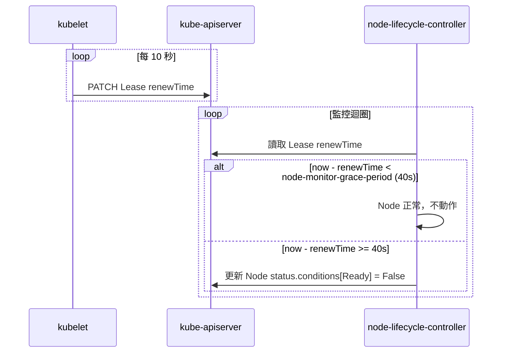
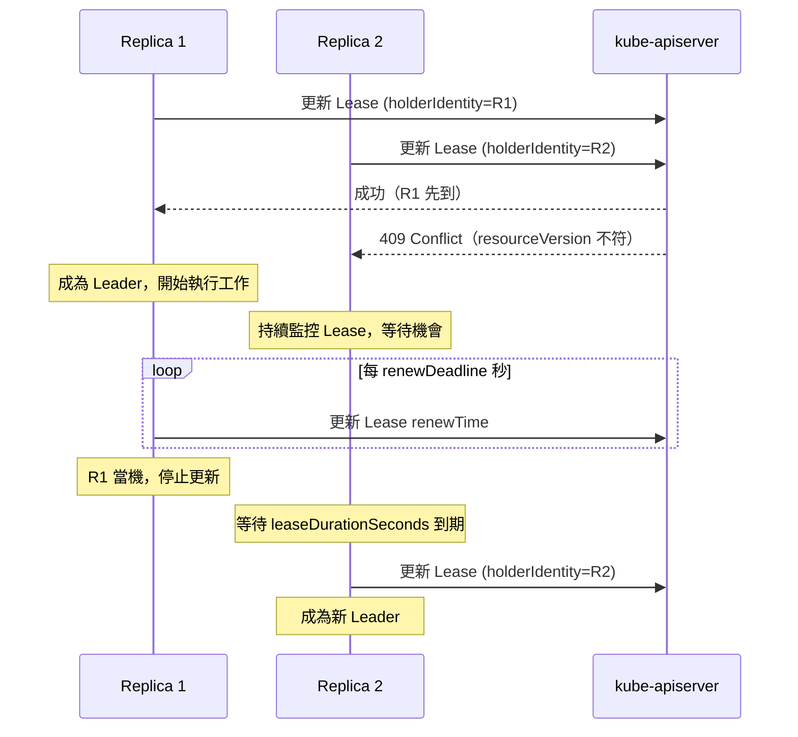

---
categories:
  - Kubernetes
description: Kubernetes 的 Lease 是一個輕量級的資源，用於實現 Node Heartbeat、Controller Leader Election 以及 API Server Identity，本文將借紹 Lease 在這三個場影的運作方式。
tags:
  - 技術分享
  - Kubernetes
date: 2026-04-04
title: 深入 Kubernetes：Lease 如何實現 Node Heartbeat 與 Leader Election
draft: false
---

當一個 Kubernetes 節點突然失去網路連線，叢集是怎麼知道的？kube-scheduler 又是怎麼知道不要再把 Pod 排程到那個節點上？是透過一個叫做 Lease 的 resource。

<!-- more -->

Lease（`coordination.k8s.io/v1`）是 K8s 的一個 resource，功能是讓元件可以定期宣告自己的存活狀態，或競爭持有某種鎖。Kubernetes 本身有三個主要的 Lease 使用場景：

1. **Node Heartbeat**：kubelet 定期更新 Lease，讓叢集知道節點還活著
2. **Leader Election**：多個 Controller replica 競爭同一個 Lease，持有者成為 Leader
3. **API Server Identity**：kube-apiserver 透過 Lease 標示自己的存在

## Lease Resource 的結構

先看一個實際的 Lease：

```yaml
apiVersion: coordination.k8s.io/v1
kind: Lease
metadata:
  labels:
    apiserver.kubernetes.io/identity: kube-apiserver
    kubernetes.io/hostname: master-1
  name: apiserver-07a5ea9b9b072c4a5f3d1c3702
  namespace: kube-system
spec:
  holderIdentity: apiserver-07a5ea9b9b072c4a5f3d1c3702_0c8914f7-0f35-440e-8676-7844977d3a05
  leaseDurationSeconds: 3600
  renewTime: "2023-07-04T21:58:48.065888Z"
```

`spec` 裡只有三個欄位，但這三個欄位就是整個機制的核心：

- `holderIdentity`：這個 Lease 目前由誰持有
- `leaseDurationSeconds`：持有者應該多久更新一次 Lease
- `renewTime`：持有者上次更新的時間

判斷 Lease 是否過期只需要一個算式：`renewTime + leaseDurationSeconds < 當前時間`。簡單，但夠用。

## Node Heartbeat

### 為什麼要用 Lease？

Kubernetes 1.13 之前，kubelet 透過定期更新 Node 物件本身的 `status.conditions` 來表示節點存活。這個做法的問題在於：Node Status 包含大量資訊（容量、可用資源、各種 condition），每次更新都要把一大包資料寫進 etcd，在大型叢集裡對 API Server 和 etcd 的壓力相當可觀。

從 1.13 開始，kubelet 改用一個輕量的 Lease 做心跳，Node Status 只在有實際變化時才更新。

### kubelet 如何更新 Lease

每個節點在 `kube-node-lease` namespace 下都有一個同名的 Lease。用 kubectl 看：

```bash
kubectl get lease -n kube-node-lease
NAME       HOLDER     AGE
master-1   master-1   45d
worker-1   worker-1   45d
worker-2   worker-2   45d
```

```bash
kubectl get lease worker-1 -n kube-node-lease -o yaml
apiVersion: coordination.k8s.io/v1
kind: Lease
metadata:
  name: worker-1
  namespace: kube-node-lease
spec:
  holderIdentity: worker-1
  leaseDurationSeconds: 40
  renewTime: "2026-03-25T10:23:45.123456Z"
```

kubelet 的更新頻率是 `leaseDurationSeconds / 4`。預設 `leaseDurationSeconds` 是 40 秒，所以每 10 秒更新一次。這個值透過 kubelet 的 `--node-lease-duration-seconds` 參數調整。

### kube-controller-manager 如何偵測節點失聯

kube-controller-manager 裡的 node-lifecycle-controller 負責監控節點狀態。它定期讀取 `kube-node-lease` 下的 Lease，計算距離上次 `renewTime` 過了多久：



`--node-monitor-grace-period` 預設是 40 秒，在 kube-controller-manager 的啟動參數裡設定。超過這個時間沒收到心跳，節點被標記為 `NotReady`。

節點變成 `NotReady` 後，kube-scheduler 就不再把 Pod 排程到這個節點。再等 `--default-not-ready-toleration-seconds`（預設 300 秒），node-lifecycle-controller 會把這個節點上的 Pod evict 出去，讓它們在其他節點重啟。

> `pod-eviction-timeout` 在 Kubernetes 1.24 後被 `--default-not-ready-toleration-seconds` 和 `--default-unreachable-toleration-seconds` 取代，預設都是 300 秒。

### 相關參數整理

| 參數 | 預設值 | 說明 |
|------|--------|------|
| `--node-lease-duration-seconds` (kubelet) | 40s | Lease 的 leaseDurationSeconds |
| `--node-status-update-frequency` (kubelet) | 10s | Node Status 更新頻率（有變化時） |
| `--node-monitor-grace-period` (kube-controller-manager) | 40s | 多久沒心跳就標記 NotReady |
| `--default-not-ready-toleration-seconds` (kube-controller-manager) | 300s | NotReady 節點上的 Pod 被驅逐前的等待時間 |

## Leader Election

### 為什麼需要 Leader Election？

kube-controller-manager、kube-scheduler 這類元件，為了高可用性通常會跑多個 replica。但它們的邏輯不能同時執行（否則會有 race condition），需要選出一個 Leader 來實際工作，其他 replica 待機。

在 Kubernetes 生態裡面，最常見的做法是利用 Lease 機就制，也是 controller 開發框架提供的方案。

### 搶 Lease 的過程

多個 replica 啟動後，都會嘗試對同一個 Lease 物件執行更新。Kubernetes API Server 保證對同一資源的更新是原子的（透過 etcd 的 compare-and-swap），所以同一時間只有一個 replica 能成功寫入：



幾個關鍵的時間參數：

- **renewDeadline**：Leader 必須在這個時間內更新 Lease，否則自行放棄 Leader 身份
- **leaseDurationSeconds**：Lease 有效期，非 Leader 等這麼久後才能嘗試搶 Lease
- **retryPeriod**：非 Leader 嘗試取得 Lease 的間隔

> compare-and-swap 透過 `resourceVersion` 實現。每次成功更新資源後，`resourceVersion` 遞增。兩個 replica 同時更新時，只有帶著當前 `resourceVersion` 的請求會成功，另一個收到 409 Conflict。這保證了即使兩個 controller 向 api server 發起請求，也只有一個人會成功。

### 用 controller-runtime 實作 Leader Election

如果你在寫 Kubernetes Operator，`controller-runtime` 已經內建 Leader Election 支援，在 `ctrl.NewManager` 時開啟即可：

```go
mgr, err := ctrl.NewManager(ctrl.GetConfigOrDie(), ctrl.Options{
    LeaderElection:          true,
    LeaderElectionID:        "my-operator-leader",
    LeaderElectionNamespace: "my-namespace",
})
```

背後的實作在 [`pkg/manager/internal.go`](https://github.com/kubernetes-sigs/controller-runtime/blob/5a8edf690e74493ca451fa15208e7c74570a7464/pkg/manager/internal.go#L617)，它建立一個 `resourcelock.LeaseLock`，然後用 `leaderelection.RunOrDie` 開始競爭 Lease。

查看 `kube-system` 下的 Leader Election Lease：

```bash
kubectl get lease -n kube-system
```

```
NAME                                      HOLDER                    AGE
kube-controller-manager                   master-1_abc123           45d
kube-scheduler                            master-1_def456           45d
apiserver-07a5ea9b9b072c4a5f3d1c3702      apiserver-07a5...         45d
```

## API Server Identity

從 Kubernetes 1.26 開始，每個 kube-apiserver 在 `kube-system` namespace 下建立一個以自己 UUID 命名的 Lease，標示自己的存在：

```bash
kubectl get lease -n kube-system -l apiserver.kubernetes.io/identity=kube-apiserver
```

這個機制讓其他元件能夠得知目前叢集中有多少個 API Server 在運行，也可以用來偵測 API Server 的異常離線。目前這個功能是為未來擴充用途預留的基礎設施，[KEP-1965](https://github.com/kubernetes/enhancements/issues/1965) 有詳細的設計說明。

## 總結

Lease 是 Kubernetes 裡輕量但很關鍵的機制。三個使用場景的邏輯其實都一樣：holder 定期更新 `renewTime`，觀察者透過 `renewTime + leaseDurationSeconds` 判斷 Lease 是否有效。差別只在於 holder 是誰、觀察者是誰，以及 Lease 失效後的處理方式。

## 參考資料

- [Kubernetes Docs: Leases](https://kubernetes.io/docs/concepts/architecture/leases/)
- [Kubernetes Docs: Nodes](https://kubernetes.io/docs/concepts/architecture/nodes/)
- [hwchiu.com: Node Failure 系列](https://www.hwchiu.com/docs/2023/node-failure-1)
- [controller-runtime: manager/internal.go](https://github.com/kubernetes-sigs/controller-runtime/blob/5a8edf690e74493ca451fa15208e7c74570a7464/pkg/manager/internal.go#L617)
- [How to Add Kubernetes-Powered Leader Election to Your Go Apps](https://dev.to/sklarsa/how-to-add-kubernetes-powered-leader-election-to-your-go-apps-57jh)
