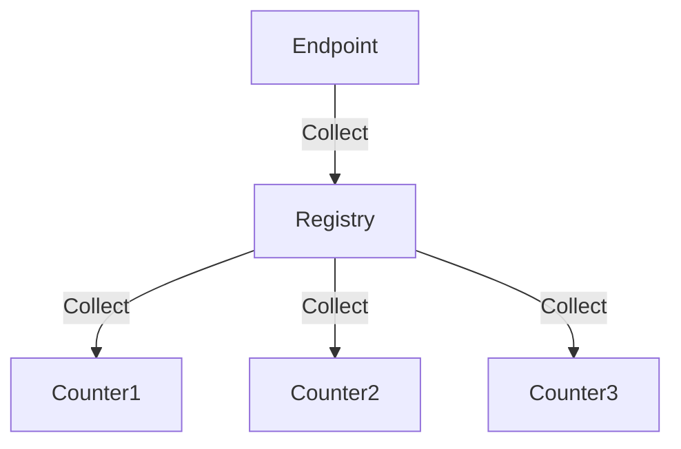
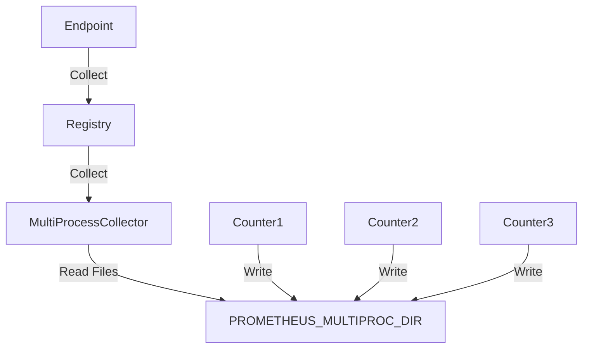

## 前言

我使用 Python 的 FastAPI 開發了一個專案，並計畫導入 Prometheus 來收集 metrics。然而，在撰寫單元測試時，我遇到了許多神秘的問題。本來以為只是測試寫錯，但深入研究後發現，這其實與 Prometheus 的 Python SDK (prometheus_client) 的 multiprocess 實作方式有關。

這篇文章將簡單探討 Prometheus 的 Python Client SDK 的多 multiprocess 設計，如何將其整合到 FastAPI 專案中，以及如何實現單元測試。同時，我也會說明我遇到的問題以及目前能想到的解決方案。

## Prometheus Client SDK 基本介紹

對於 API Server，我們通常希望收集一些 metrics，例如：
+ requests 的總數
+ response time
+ HTTP 200 回應數量
+ 其他與商業邏輯相關的 metrics

這些 metrics 可以透過 Prometheus 進行收集，並搭配 Grafana、Alert Manager 等工具進行監控。Prometheus 官方提供了一個 Python SDK，讓開發者能夠快速開發實作 metrics 並導出到 Prometheus。

首先，我們來看看如何在 FastAPI 中使用 Prometheus Python Client SDK。


這段程式碼展示了如何定義 `Counter`，用來計算所有 API Endpoint 的 請求次數：

```python
# main.py
from prometheus_client import Counter, make_asgi_app
from fastapi import FastAPI, Request
from starlette.middleware.base import BaseHTTPMiddleware

counter = Counter('http_requests_total', 'Total HTTP requests', ['method', 'endpoint'])

app = FastAPI()

class PrometheusMiddleware(BaseHTTPMiddleware):
    async def dispatch(self, request: Request, call_next):
        counter.labels(request.method, request.url.path).inc()
        response = await call_next(request)
        return response
app.add_middleware(PrometheusMiddleware)
```

這邊我們定義了一個 `counter`，並註冊成 FastAPI 的 `middleware`，每次有 request 進來的時候，`counter` 的數值就會加一 (`inc`)，且會將 `HTTP method` 和 `URL path` 作為 `label`，以便區分不同的 endpoints。

接著，我們需要定義 `/metrics` 端點，讓 Prometheus 能夠拉取 metrics 資料：

```python
app.mount("/metrics", make_asgi_app())
```

接著我們訪問端點就可以取得 metrics 資料，因為我們訪問 `/metrics/` 這個端點，所以我們可以看到 `http_requests_total` 這個 counter 的數值是 1。

```shell
# fastapi main.py

# curl 127.0.0.1:8000/metrics/
# HELP http_requests_total Total HTTP requests
# TYPE http_requests_total counter
http_requests_total{endpoint="/metrics/",method="GET"} 1.0
# HELP http_requests_created Total HTTP requests
# TYPE http_requests_created gauge
http_requests_created{endpoint="/metrics/",method="GET"} 1.7377473771929123e+09
```

> 訪問 `/metrics` 時，FastAPI 會回傳 `HTTP 307` 並導向 `/metrics`/，如果使用 `curl` 測試時，需要加上 `-L` 參數才能跟隨重導，或者直接訪問 `/metrics/`。

## 單元測試 Middleware

那我們該怎麼對這個 `middleware` 進行單元測試呢？我們希望使用 pytest 對這個 `middleware` 進行單元測試，確保 metrics 能夠正確被記錄，以及導出到端點。

```python
# test_main.py
from main import app
from fastapi.testclient import TestClient

client = TestClient(app)

def test_middle():
    response = client.get("/metrics/")
    assert response.status_code == 200
    assert 'http_requests_total{endpoint="/metrics/",method="GET"} 1.0' in response.text
```

FastAPI 提供 `TestClient` 讓我們可以模擬 API 請求並進行測試。在這個測試中，我們對 `/metrics/` 發送 `GET` 請求，並檢查回傳的 metrics 是否包含 `http_requests_total{endpoint="/metrics/",method="GET"} 1.0`。

```shell
pytest test.py 
...
====================== 1 passed, 1 warning in 0.43s =======================
```

當然我們得到了我們預期的結果，這個測試是成功的。


## Multiprocess 設計
接著，我們就要談到 prometheus python client 的 multiprocess 設計，上面的 `middleware` 在 multiprocess 的情況下是會有問題的，因為 `counter` 存在於每個 process 的記憶體中，因此不同 process 的計數互不相通。這導致 `/metrics` 端點回傳的內容，僅包含當前 process 的計數，而不是所有 process 的總和。

### Prometheus 的解決方案

Prometheus Python Client 提供的解法是：
1. 每個 process 先將 metrics 資料寫入各自的檔案中
2. 當訪問 `/metrics` 時，統一讀取所有檔案，合併數據後再回傳

使用上也很簡單：

```python
# main.py
import os
os.environ['PROMETHEUS_MULTIPROC_DIR'] = '/dev/shm'
```
首先，我們需要設定 `PROMETHEUS_MULTIPROC_DIR` 環境變數，指定 metrics 檔案的儲存路徑。這樣一來，所有 `Counter` 都會自動進入 multiprocess 模式，並將資料寫入對應的檔案。

```python
def make_prometheus_app():
    registry = CollectorRegistry()
    multiprocess.MultiProcessCollector(registry=registry)
    return make_asgi_app(registry=registry)

app.mount("/metrics", make_prometheus_app())
```

接著，我們需要修改 `/metrics` 端點的導出方式，確保它能夠讀取多個 process 的數據並合併：

`CollectorRegistry` 是用來管理所有計數器的結構，所有的 Counter、Gauge、Histogram、Summary 都會向一個或多個 Registry 註冊。當我們訪問 `/metrics` 時，實際上是呼叫 registry 的 `collect()` 方法，registry 會對應調用所有註冊在裡面計數器的 `collect()` 方法，將所有 metrics 資料合併起來導出。



前面我們定義 `Counter` 和使用 `make_metrics_app` 的時候沒有定義 `registry`，但是 prometheus client 會使用一個預設的 `registry` 來保存。

```python
# prometheus_client/asgi.py
def make_asgi_app(registry: CollectorRegistry = REGISTRY):
    ...

# prometheus_client/multiprocess.py
class Counter(MetricWrapperBase):

# prometheus_client/metrics.py
class MetricWrapperBase(Collector):
    def __init__(self: T,
                ...
                registry: Optional[CollectorRegistry] = REGISTRY,
                ...
                ) -> None:
```
可以看到，這邊都使用了一個 `REGISTRY` 作為預設參數，這個 `REGISTRY` 就是一個預設全域變數的 CollectorRegistry。

```python
# prometheus_client/registry.py
...
REGISTRY = CollectorRegistry()
```

所以 `make_asgi_app` 會呼叫 `REGISTRY.collect()`，而 `REGITRY.collect()` 則會呼叫到 `counter.collect()`。

接著讓我們回到 multi proccess 的程式碼。
```python
def make_prometheus_app():
    registry = CollectorRegistry()
    multiprocess.MultiProcessCollector(registry=registry)
    return make_asgi_app(registry=registry)

app.mount("/metrics", make_prometheus_app())

```

這邊，我們定義了一個空的 `registry` 覆蓋 `make_asgi_app` 預設的 `REGISTRY`，並且其中只有放入 MultiProcessCollector。所以當我們呼叫 `/metrics` 的時候，等價於呼叫 `MultiProcessCollector.collect()`，MultiProcessCollector 會讀取 `PROMETHEUS_MULTIPROC_DIR` 中的所有的檔案，將所有 process 的 metrics 資料合併起來導出。



在 prometheus 裡面，計數器有 `Counter`, `Gauge`, `Histogram`, `Summary` 等種類，對於每個類型計數器的不同 Process，prometheus client 都會寫到 PROMETHEUS_MULTIPROC_DIR/<Kind>_<PID>.db 的檔案裏面。

```shell
ls /dev/shm
counter_2463.db  counter_3743.db
```

### 第一個陷阱：PROMETHEUS_MULTIPROC_DIR 的設置時間

如果，如果按照我上面描述的方式撰寫出以下的程式碼，將環境變數的設置放在 Import 後面的第一行。
```python
import os
from prometheus_client import Counter, CollectorRegistry, multiprocess, make_asgi_app
from fastapi import FastAPI, Request
from starlette.middleware.base import BaseHTTPMiddleware

os.environ['PROMETHEUS_MULTIPROC_DIR'] = '/dev/shm'
```

那麼你就會發現，不論怎麼讀 `/metrics`都是空的。而原因呢，我們就需要了解 Prometheus Client 是怎麼判定是否要啟用 multiprocess 模式，將 metrics 寫入檔案的。

```python
counter = Counter('http_requests_total', 'Total HTTP requests', ['method', 'endpoint'])

# prometheus_client/metrics.py
class Counter(MetricWrapperBase):
    def _metric_init(self) -> None:
        self._value = values.ValueClass(self._type, self._name, self._name + '_total', self._labelnames,
                                        self._labelvalues, self._documentation)
        self._created = time.time()
```

可以看到，在 `Counter` 內部會呼叫 `_metric_init` 函數，實例化用於保存數值的 `values.ValueClass`。

```python
### prometheus_client/values.py
def get_value_class():
    # Should we enable multi-process mode?
    # This needs to be chosen before the first metric is constructed,
    # and as that may be in some arbitrary library the user/admin has
    # no control over we use an environment variable.
    if 'prometheus_multiproc_dir' in os.environ or 'PROMETHEUS_MULTIPROC_DIR' in os.environ:
        return MultiProcessValue()
    else:
        return MutexValue

ValueClass = get_value_class()
```
而這個 `ValueClass` 實際上是一個全域變數，會被`metrics.py` 導入，因此，當我們 `import prometheus_client` 時，prometheus client 就已經根據環境變數 `PROMETHEUS_MULTIPROC_DIR` 是否存在來決定是否要啟用 multiprocess 模式了。

這邊 `ValueClass` 會變成是 `MultiProcessValue()` 的返回值，但具體是是甚麼，我們後面再來看。

所以，如果我們在 `import prometheus_client` 之後才設置環境變數，那麼 prometheus client 就不會啟用 multiprocess 模式，而是單純把數值保存在記憶體中。

因此，如果要透過程式碼設置去啟用這個功能的話，我們必需要在 import 之前設置好環境變數，又或是在執行 Python 前就完成環境變數的設置。

```python
import os
os.environ['PROMETHEUS_MULTIPROC_DIR'] = '/dev/shm'

from prometheus_client import Counter, CollectorRegistry, multiprocess, make_asgi_app
from fastapi import FastAPI, Request
from starlette.middleware.base import BaseHTTPMiddleware
```

## 第二個陷阱：環境變數的設置
因為我們採用了 multiprocess 的模式，為了單元測試，我們需要確保每次測試前後 `PROMETHEUS_MULTIPROC_DIR` 是空的，不然就會讀到上一次測試的 metrics 資料以及其他測試的紀錄。

直覺的想法是我們就修改 `PROMETHEUS_MULTIPROC_DIR` 的位置，將 metrics 保存到暫時的資料夾中。因此，第一版的測試修改後變成這樣。

```python
# test_main.py
import os
import tempfile
from main import app
import pytest
from fastapi.testclient import TestClient

client = TestClient(app)

@pytest.fixture()
def clean_metrics():
    os.environ['PROMETHEUS_MULTIPROC_DIR'] = tempfile.mkdtemp()
    yield
    shutil.rmtree(os.environ['PROMETHEUS_MULTIPROC_DIR'])


def test_middle(clean_metrics):
    response = client.get("/metrics")
    assert response.status_code == 200
    assert 'http_requests_total{endpoint="/metrics/",method="GET"} 1.0' in response.text
```

要特別注意的是我們在 main.py 的開頭有設置一次 `PROMETHEUS_MULTIPROC_DIR`，所以我們可以確保 multiprocess 的模式是啟用的。

這邊藉由 pytest 的語法來插入一個 pretest 和 posttest 的 action。
我們藉由 `tempfile.mkdtemp()` 取得一個隨機目錄，然後修改 `PROMETHEUS_MULTIPROC_DIR` 的位置，讓 metrics 保存到這個目錄中，然後，在測試結束後刪除這個目錄。

跑了這個測試你會發現不論怎麼跑 metrics 這個端點回傳都是空的，或著如果你有先跑過幾次這個 API，然後才跑測試你會發現，他會回復之前的資料，並且這次測試訪問不會被記錄到。

要瞭解為甚麼發生這種神奇的現象，要了解一下  multiprocess collector 是如何決定要讀取哪個資料夾的。

Multiprocess Collector 會在初始化的時候就決定要讀取哪個資料夾。

```python
# site-packages/prometheus_client/multiprocess.py
class MultiProcessCollector:
    """Collector for files for multi-process mode."""

    def __init__(self, registry, path=None):
        if path is None:
            path = os.environ.get('PROMETHEUS_MULTIPROC_DIR')
        self._path = path
```

並且我們在 `import main.py` 的時候就已經完成了對 `MultiProcessCollector` 的初始化。

```python
# main.py
def make_prometheus_app():
    registry = CollectorRegistry()
    multiprocess.MultiProcessCollector(registry=registry)
    return make_asgi_app(registry=registry)

app.mount("/metrics", make_prometheus_app())
```

所以 `MultiprocessCollector` 會去查看原本設定的 `/dev/shm`，自然就讀不到測試的資料。


## 陷阱三：消失的 metrics

那麼有沒有辦法在，不修改主程式的情況下，修復測試造成的錯誤。那我想到，我們就不要改路徑，直接把 `PROMETHEUS_MULTIPROC_DIR` 清理乾淨，那麼這樣就可以了吧？

```python
@pytest.fixture()
def clean_metrics():
    for filename in glob.glob(os.environ['PROMETHEUS_MULTIPROC_DIR']+'/*'):
        os.remove(filename)
    yield
    for filename in glob.glob(os.environ['PROMETHEUS_MULTIPROC_DIR']+'/*'):
        os.remove(filename)
```

恭喜你會發現這個測試是行的通的！

然而當你添加了另外一個測試，並且這個測試跑在 middleware 的測試之前執行，你就會發現，`client.get("/metrics")` 回傳的資料又是空的了，這是為什麼呢？

這時候，我們就需要深入了解 `Counter` 是如何把資料保存到檔案中的。

```python
class Counter(MetricWrapperBase):
    def _metric_init(self) -> None:
        self._value = values.ValueClass(self._type, self._name, self._name + '_total', self._labelnames,
                                        self._labelvalues, self._documentation)
```

前面我們有說過，`Counter` 的實際讀寫是透過 `values.ValueClass`，並且在 import 的時候被指定為 `MultiProcessValue()`。

```python
def MultiProcessValue(process_identifier=os.getpid):
    """Returns a MmapedValue class based on a process_identifier function.

    The 'process_identifier' function MUST comply with this simple rule:
    when called in simultaneously running processes it MUST return distinct values.

    Using a different function than the default 'os.getpid' is at your own risk.
    """
    files = {}
    values = []
    pid = {'value': process_identifier()}
    # Use a single global lock when in multi-processing mode
    # as we presume this means there is no threading going on.
    # This avoids the need to also have mutexes in __MmapDict.
    lock = Lock()

    class MmapedValue:
        """A float protected by a mutex backed by a per-process mmaped file."""

        _multiprocess = True

        def __init__(self, typ, metric_name, name, labelnames, labelvalues, help_text, multiprocess_mode='', **kwargs):
            with lock:
                ...
                self.__reset()
                ...

        def __reset(self):
            typ, metric_name, name, labelnames, labelvalues, help_text, multiprocess_mode = self._params
            file_prefix = typ
            if file_prefix not in files:
                filename = os.path.join(
                    os.environ.get('PROMETHEUS_MULTIPROC_DIR'),
                    '{}_{}.db'.format(file_prefix, pid['value']))

                files[file_prefix] = MmapedDict(filename)
            self._file = files[file_prefix]
            self._key = mmap_key(metric_name, name, labelnames, labelvalues, help_text)
            self._value, self._timestamp = self._file.read_value(self._key)

        def inc(self, amount):
            ...
        def set(self, value, timestamp=None):
            ...
        def get(self):
            ...


    return MmapedValue
```
可以看到實際上，values.ValueClass 是 `MmapedValue` 。 

`MmapedValue` 的 `__init__` 會呼叫到 `__reset`，而 `__reset` 會實例化一個 `MmapedDict`，由 `MmapedDict` 來與實際的檔案互動操作。

可以發現，這邊會使用 `file_prefix` 作為 key，將 `MmapedDict` 保存在 `files` 這個 dictionary 中，file_prefix 實際上是 Metrics 的類型，也就是 Counter、Gauge、Histogram、Summary 等等。
而 files 是保存在 `MultiProcessValue` 函數的上下文當中的，因為 `MultiProcessValue` 只會在 `values.py` 被 import 得時候被執行一次，所以每個類型 metrics 的 `MmapedDict` 都是全局唯一的。

```python
### prometheus_client/values.py
def get_value_class():
    # Should we enable multi-process mode?
    # This needs to be chosen before the first metric is constructed,
    # and as that may be in some arbitrary library the user/admin has
    # no control over we use an environment variable.
    if 'prometheus_multiproc_dir' in os.environ or 'PROMETHEUS_MULTIPROC_DIR' in os.environ:
        return MultiProcessValue()
    else:
        return MutexValue

ValueClass = get_value_class()
```

當我們第一次寫入 `Counter` 時，`_metric_init` 會被觸發建立 `MmapedDict` 實例，將檔案透過 MMAP 映射到記憶體中操作，後續所有 `Counter` 的操作都會透過這個 `MmapedDict` 來操作檔案。

> 因為實際上是透過 MMAP 操作，加上這個也只是臨時檔案，所以才會建議將檔案放置在 `/dev/shm` 這個純記憶體的檔案系統中，提高 IO 效能。

> 如果實際去看 `Counter` 的原始碼，會發現在 `Couter` 的 base `MetricWrapper` ，`__init__` 會呼叫 `_metric_init`，但是會先過一個判斷是會先過一個判斷是，`if self._is_observable()`，實際上這個數值會是 `False`，導致 `_metric_init` 不備呼叫。Prometheus 的設計是每次呼叫 `counter.labes(...)` 的時候，會為每組不同的 `labels`，會建立一個 `Counter` 實例，這個子實例的 `Observable` 才會是 True，才會呼叫 `_metric_init`。

```python
@pytest.fixture()
def clean_metrics():
    for filename in glob.glob(os.environ['PROMETHEUS_MULTIPROC_DIR']+'/*'):
        os.remove(filename)
    yield
    for filename in glob.glob(os.environ['PROMETHEUS_MULTIPROC_DIR']+'/*'):
        os.remove(filename)
```
假設，我們 middleware 的 test 不是第一個執行的，當其他測試進行時，就會記錄到 `http_requests_total` 的 `Counter`，導致 `MmapedDict` 被建立。當執行到我們的測試時，`clean_metrics`會把對應的檔案刪除，但是 `MmapedDict` 不會被刪除，因此當 mddleware 的 test 執行時，實際上就不會寫入到任何地方，同時因為只是 MMAP 記憶體對應的檔案消失， `MmapedDict` 也不會報錯。
因為，pytest 執行不同的 test 實際上不會重新 import，所以 `MmapedDict` 不會被重新建立。

## 解決方案

最後想到一個比較簡單的方案，來讓測試通過，就是只在測試後刪除檔案。
```python
@pytest.fixture()
def clean_metrics():
    yield
    for filename in glob.glob(os.environ['PROMETHEUS_MULTIPROC_DIR']+'/*'):
        os.remove(filename)
```

這樣可以確每次測試後，都不會留下任何 metrics 的檔案，因為執行後續其他測試項目時，也不會重建檔案，反正 metrics 的資料對於其他單元測試來說無意義。另外，我們的單元測試會檢查一個特殊的 metrics `http_requests_total{endpoint="/metrics/",method="GET"}`，我們可以確保其他測試不會呼叫到 `/metrics` 這個端點，所以這個測試也不會受到其他測試向的影響。

## 結論

在這次紀錄中，我們探討了 Prometheus SDK 的運作原理。Prometheus SDK 透過檔案來記錄各個 Process 的 metrics，並聚合起來產生實際的 metrics 資料。
`PROMETHEUS_MULTIPROC_DIR` 會決定 metrics 檔案的保存位置，並在 `import prometheus_client` 的時候，SDK 會根據該變數是否設置來決定 `Couter` 要採用 singleprocess 還是 multiprocess 的行為，所以要在 import 之前設置好環境變數。
`MultiProcessCollector` 會在初始化的時候讀取 `PROMETHEUS_MULTIPROC_DIR` ，並且在之後的操作都會讀取這個資料夾。
`Couter` 等計數器會在第一次寫入數值時，打開檔案建立 MMAP，測試切換後，因為 pytest 實際上不會重新 import，所以 MmapedDict 不會被刪除，如果檔案被刪除，並不會報錯，但也不會建立新的檔案。
