---
categories:
  - Networking
description: 在上一篇文章《搞懂數位憑證：檔案格式、簽署與驗證流程》中，我們探討了數位憑證的基礎。本文將以此為基礎，接著學習 TLS 1.2 的運作原理，金鑰交換機制與完整的握手流程，為後續理解 TLS 1.3 的演進做好準備。
tags:
  - TLS
  - HTTPS
  - 網路協定
  - 資安
date: 2025-06-25
title: 搞懂 TLS 1.2 金鑰交換原理與握手
draft: true
---



在上一篇文章《[搞懂數位憑證：檔案格式、簽署與驗證流程](https://blog.louisif.me/posts/understanding-digital-certificates-formats-signatures-and-verification/)》中，我們探討了數位憑證的基礎。本文將以此為基礎，接著學習 TLS 1.2 的運作原理，為後續理解 TLS 1.3 的演進做好準備。這篇主要集中在概念和架構上，不會過多討論密碼學的內容。

<!-- more -->

## 前言

TLS 協定的核心目標之一，是讓客戶端（Client）與伺服器端（Server）在不安全的網路上，能夠協商出一組共用的對稱金鑰，這個過程稱為金鑰交換（Key Exchange）。一旦金鑰交換完成，後續的通訊就能使用這組金鑰，透過 AES 等較高效率的對稱加密演算法來加密傳輸內容。在 TLS 架構中，這個交換的金鑰被稱為 `premaster secret`。

> `premaster secret` 並不會直接用於加密通訊流量。它會與客戶端及伺服器交換的隨機數（randoms）結合，經過一個偽隨機函數（Pseudorandom Function, PRF）的運算，衍生出真正的 `master secret`。而 `master secret` 也非直接使用，它會再透過 PRF 衍生出多組會話金鑰（session keys），這些金鑰才會實際用於加密與驗證資料的完整性。不過 `master secret` 就不在這篇文章的討論範圍了。

```c
master_secret = PRF(pre_master_secret, "master secret",
ClientHello.random + ServerHello.random)
[0..47];
```

我們會先介紹 TLS 金鑰交換的核心概念，然後了解完整的 TLS 1.2 握手流程。

## 金鑰交換方式

### 1. RSA 金鑰交換

讓我們從經典的 RSA 演算法來介紹金鑰交換的方式。RSA 金鑰交換的流程概念如下：

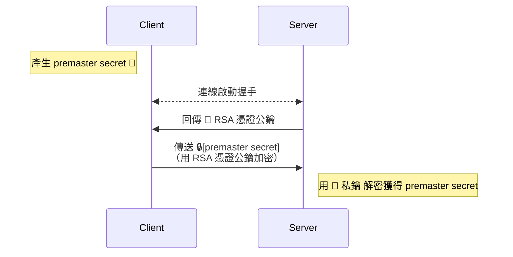


1. Client 產生一個隨機的 `premaster secret`。
    
2. Client 從 Server 的憑證中取得公鑰。
    
3. Client 使用該公鑰將 `premaster secret` 加密後傳送給 Server。
    
4. Server 使用自己的私鑰解密，取得 `premaster secret`。
    

憑證確保了公鑰的合法性，以防止中間人攻擊。然而，它存在一個致命缺陷：缺乏向前保密性（Forward Secrecy）。

因為加密 `premaster secret` 的是憑證中的長期公鑰，一旦伺服器的私鑰在未來某個時間點外洩，攻擊者便能解密所有過去攔截到的 TLS 流量，還原出 `premaster secret`，進而破解所有歷史通訊內容。

> RSA 可以應用在加密，數位簽章等不同領域，根據功能和具體計算公式有不同的種類。
> 在 RFC 3447（PKCS #1）中規範了其加密與數位簽章的具體用法。加密方案稱為 RSAES（如 RSAES-OAEP、RSAES-PKCS1-v1_5），數位簽章方案稱為 RSASSA（如 RSASSA-PSS、RSASSA-PKCS1-v1_5）。它們的主要差異在於對原始資料的填充（padding）與加鹽（salting）設計，其中 RSAES-OAEP 和 RSASSA-PSS 是較新且更安全的選擇。

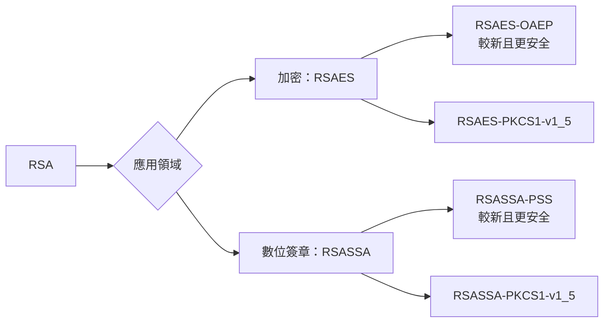

> 如果去查閱 RSA 和其他非對稱加密演算法的實作細節，會發現公鑰和私鑰實際上並不只是單一個數字，而是由兩到三個數值所構成。例如，在 [RSA 加密演算法 - 維基百科，自由的百科全書](https://zh.wikipedia.org/zh-tw/RSA%E5%8A%A0%E5%AF%86%E6%BC%94%E7%AE%97%E6%B3%95) 中指出，RSA 公鑰由 \\(\displaystyle (N,e)\\) 組成，而私鑰則是 \\(\displaystyle (N,d)\\)。我們平常使用的一長串 public key 與 private key，實際上就是將這些數值經過 ASN.1/DER 編碼後的結果。因此，在解析這些金鑰檔案時，會看到結構化的欄位對應上述數值，而不是單一的純量值。

### 2. 臨時金鑰交換（Ephemeral Key Exchange）

為了實現向前保密性，TLS 引入了臨時金鑰交換機制。即使憑證的私鑰外洩，過去的通訊內容依然安全。這類機制的核心思想，是將伺服器身份驗證與金鑰交換的公私鑰分離。

但在這之前要介紹**迪菲 - 赫爾曼金鑰交換** (Diffie–Hellman key exchange, DH）演算法，這是有別於 RSA 的另一套專門用於金鑰交換的演算法。在基於 DH 的 TLS 握手過程中：

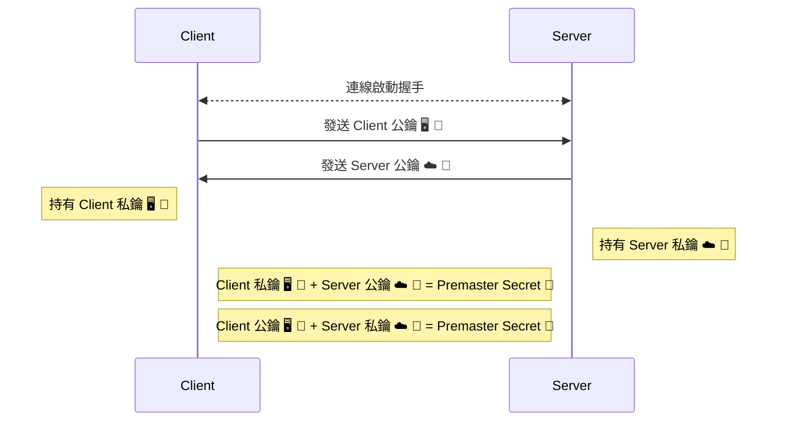


1. 雙方交換彼此的 DH 公鑰。
    
2. 雙方將自己的 DH 私鑰與對方的 DH 公鑰透過 DH 演算法，各自獨立計算出完全相同的 `premaster secret`。
    

不過 DH 主要是在數學計算以及雙方同時交換這點上與 RSA 不同。如果依舊使用固定憑證，還是會缺乏向前保密性。因此更常用的是 DH 的變體 DHE（D-H Ephemeral）。

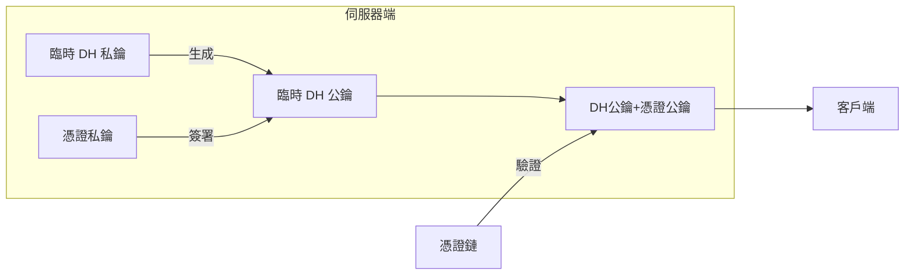

在 DHE 過程中，交換的不是長期保存的憑證，而是臨時生成出來的 DH 公私鑰。伺服器會使用憑證中的私鑰對其臨時生成的 DH 公鑰進行數位簽章，然後將簽章與 DH 公鑰一併傳給客戶端。客戶端則使用憑證中的公鑰來驗證簽章，確保這個臨時的 DH 公鑰確實來自合法的伺服器，從而防堵中間人攻擊。

由於用於金鑰交換的 DH 金鑰是臨時的，連線結束後即被銷毀，因此就算未來簽署數位簽章用的憑證的私鑰外洩，也無法還原出任何 `premaster secret`，這就實現了向前保密性。

### 3. 橢圓曲線密碼學（Elliptic Curve Cryptography, ECC）

ECC 是金鑰交換中常用的技術，與 RSA、DH 的技術差異在於其底層的數學原理：RSA 和 DH 的安全性基於大質數因式分解的困難度，而 ECC 則建立在橢圓曲線上的離散對數問題。

我們無需深入探討複雜的數學原理，但需要了解 ECC 帶來的顯著優勢：

- **更高效率**：在相同的安全等級下，ECC 的加解密運算速度更快。
    
- **更短金鑰**：ECC 能用比 RSA 短得多的金鑰長度，達到同等的安全強度。例如，一個 256 位元的 ECC 金鑰提供的安全性約等於一個 3072 位元的 RSA 金鑰。
    

這使得 ECC 特別適合運算能力有限的設備，如行動裝置和物聯網裝置。然而作為較新的技術，它在對舊系統的兼容性上，相較於 RSA 仍有不足。

在 TLS 中，我們使用的是 ECDHE，也就是基於 DHE 流程，但是使用 ECC 取代基礎公式。

ECC 基於橢圓曲線，它包含了一系列標準化的「曲線」（如 `secp256r1` (P-256), `secp384r1`），不同的曲線在安全性、效率上各有側重。

另外，當 ECC 用於實現數位簽章時，其演算法稱為 ECDSA（Elliptic Curve Digital Signature Algorithm），扮演著與 RSA 中的 RSASSA 相同的角色。

> 順帶一提，另一個常見的數位簽章標準是 DSA（Digital Signature Algorithm），它與 RSA/ECDSA 並列，但基於不同的數學原理。

### TLS 中常見金鑰交換方法關係圖

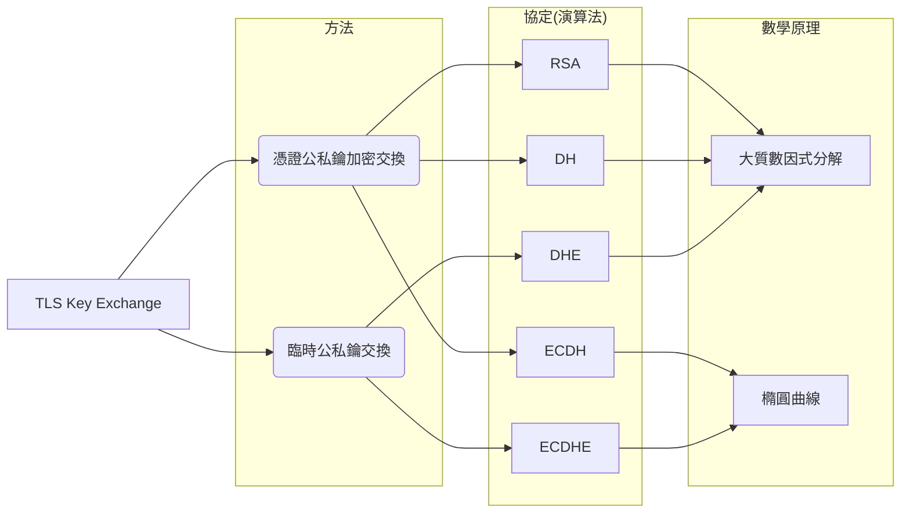


## 訊息驗證碼：確保資料的完整性

除了加密，TLS 的另一大功能是確保資料在傳輸過程中未被竄改。為此，我們需要附加一個訊息驗證碼（Message Authentication Code, MAC）來實現。

TLS 1.2 使用 HMAC（Hash-based Message Authentication Code），它是一種帶有金鑰的雜湊函數。簡單來說，HMAC 會將金鑰與原始訊息結合，進行一系列運算和雜湊。接收方使用相同的金鑰與收到的訊息執行同樣的計算，比對結果是否一致，即可確認訊息的完整性與來源的真實性。在 TLS 1.2 中，HMAC 可以搭配 MD5、SHA1、SHA256 等不同的雜湊函數。

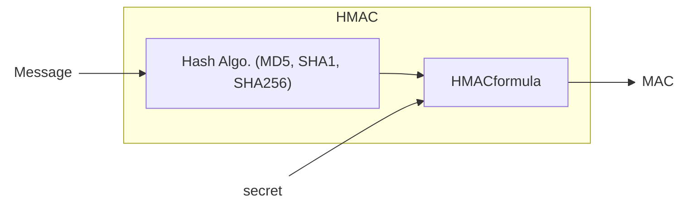


根據 RFC 2104，HMAC 的數學公式為：

$$
 {\displaystyle {\textit {HMAC}}(K,m)=H{\Bigl (}(K'\oplus opad)\;||\;H{\bigl (}(K'\oplus ipad)\;||\;m{\bigr )}{\Bigr )}}
$$
> 詳細說明參考：[HMAC - 維基百科，自由的百科全書](https://zh.wikipedia.org/zh-tw/HMAC)

### PRF：用於金鑰衍生的偽隨機函數

前面提到用於生成 `master secret` 和其他金鑰的 pseudorandom function（PRF）也是基於 HMAC 函數：

```c
P_hash(secret, seed) = HMAC_hash(secret, A(1) + seed) +
                       HMAC_hash(secret, A(2) + seed) +
                       HMAC_hash(secret, A(3) + seed) + ...
```

根據 HMAC 中使用的雜湊函數不同，對應的 PRF 可寫作 `P_hash`。在 TLS 1.2 中，PRF 固定使用 SHA256，因此稱為 `P_SHA256`。

## 加密套件（Cipher Suite）

綜合上述的金鑰交換協定、對稱加密演算法與 HAMC 中的雜湊數，三者組合起來就形成了一個 TLS 1.2 的加密套件（Cipher Suite）。加密套件的名稱看起來像一串神秘的咒語，例如：`TLS_DHE_RSA_WITH_AES_128_CBC_SHA`。

我們可以將它拆解來理解：

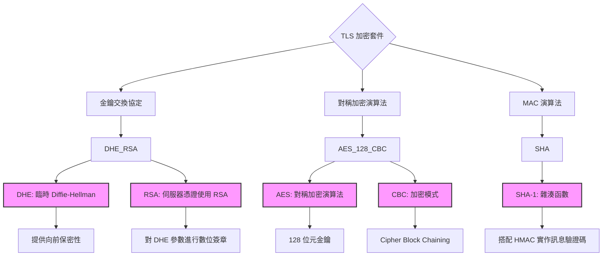

- **DHE_RSA**：代表金鑰交換方式。`DHE` 表示使用臨時 Diffie-Hellman（Ephemeral DH）交換，具備向前保密性；`RSA` 則表示伺服器的憑證使用 RSA 公私鑰，用來對 DHE 的參數進行數位簽章。
    
- **AES_128_CBC**：代表對稱加密演算法，表示使用 128 位元金鑰的 AES，加密模式為 CBC（Cipher Block Chaining）。
    
- **SHA**：代表 MAC 演算法，表示使用 SHA-1 雜湊函數搭配 HMAC 來實作訊息驗證碼。
    

在 TLS 握手之初，Client 會列出所有它支援的加密套件；Server 則從中挑選一個雙方都支援，且符合其安全策略的套件，並通知 Client。這個過程確保了雙方能以共同語言建立安全的連線。

在 [RFC 5246](https://datatracker.ietf.org/doc/html/rfc5246) 中列出了 TLS 1.2 支援的 Cipher Suites。以金鑰交換而言，可能使用 RSA、DH 或 DHE：

- **DH/DHE 金鑰交換**會搭配 DSS（DSA）或 RSA 數位簽章進行驗證，如：`TLS_DHE_DSS_WITH_3DES_EDE_CBC_SHA`。
    
- **RSA 金鑰交換**則不需要額外的簽章，因為加密 premaster secret 的就是憑證中的 RSA 公鑰。因此，cipher 只會有 RSA 一個字，如 `TLS_RSA_WITH_AES_256_CBC_SHA256`。
    

還有一種比較特殊的 `dh_anon`（anonymous DH, 如 `TLS_DH_anon_WITH_RC4_128_MD5`），它代表不驗證伺服器身份，因此會面臨中間人攻擊的風險，實務上不建議使用。

與 ECC（橢圓曲線密碼學）相關的套件則定義於 [RFC 4492](https://datatracker.ietf.org/doc/html/rfc4492)，其中包含以下幾種常見組合：

- `ECDH_ECDSA`、`ECDHE_ECDSA`
    
- `ECDH_RSA`、`ECDHE_RSA`
    
- `ECDH_anon`
    

這些組合基本上是金鑰交換（ECDH vs ECDHE）與簽章方式（RSA vs ECDSA）的排列組合。

對稱加密方面，RFC 5246 中定義了以下幾種：

- `RC4_128`
    
- `3DES_EDE_CBC`
    
- `AES_128_CBC`
    
- `AES_256_CBC`
    

但這些方式多數已存在安全性疑慮，尤其是 RC4 和 3DES，甚至 CBC 模式本身也有一些已知攻擊。因此，較建議使用具備「認證加密（AEAD）」特性的方式，例如：

- **AES-GCM**（Cipher 定義於 [RFC 5288](https://datatracker.ietf.org/doc/html/rfc5288)）
    
- **ChaCha20-Poly1305**（Cipher 定義於 [RFC 7905](https://datatracker.ietf.org/doc/html/rfc7905)）
    
 
例如：`TLS_RSA_WITH_AES_256_GCM_SHA384` 就是一個符合 AEAD 設計的加密套件。

最後，MAC 所用的雜湊函數主要包括：`MD5`、`SHA-1`、`SHA-256` 等。這些會搭配 HMAC 使用來進行訊息驗證。

## TLS 1.2 完整握手流程

在理解了 Cipher Suite 與加密機制後，我們可以來看看 TLS 1.2 的完整握手流程。以下是握手的交互流程示意圖：

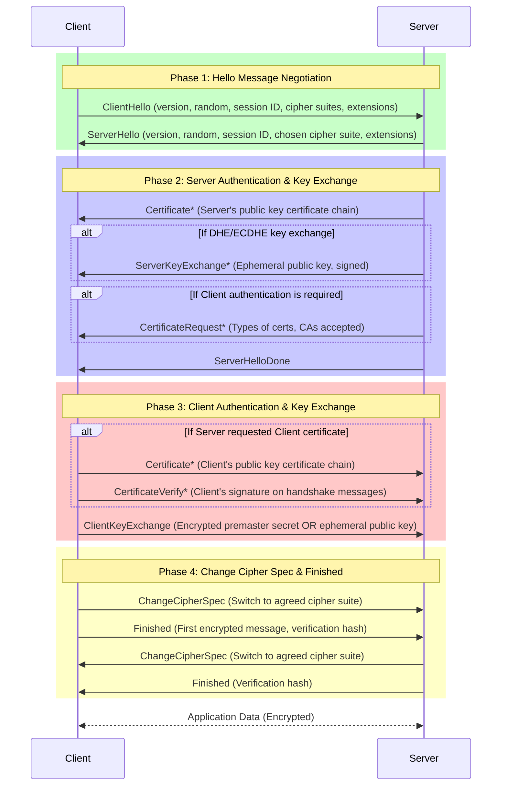

* 表示為選擇性或依使用場景而定的訊息。

### 階段一：Hello 訊息協商

**目的：雙方確認 TLS 版本、加密套件等基本參數。**

#### ClientHello

Client 發起連線，告知 Server：

- `client_version`：支援的最高 TLS 版本（例如 TLS 1.2 為 `0x0303`）。
    
- `random`：32 bytes 隨機數 `client_random`，參與 master secret 的產生。
    
- `session_id`：用於會話恢復，若無則為空。後面會在介紹會話恢復的部分。
    
- `cipher_suites`：支援的加密套件清單，按偏好排序。
    
- `extensions`：支援的 TLS 擴充功能。

+ `compression_methods`：原本是用來協商 TLS  傳輸壓縮方法的欄位，但是 TLS 壓縮有漏洞，所以其實實務上完全不會使用。
    

```c
struct {
    ProtocolVersion client_version;
    Random random;
    SessionID session_id;
    CipherSuite cipher_suites<2..2^16-2>;
    CompressionMethod compression_methods<1..2^8-1>;
    select (extensions_present) {
        case false: struct {};
        case true:  Extension extensions<0..2^16-1>;
    };
} ClientHello;
```

#### ServerHello

Server 回應並選定參數：

- `server_version`：與 Client 協商出的 TLS 版本。
    
- `random`：Server 產生的 32 bytes `server_random`。
    
- `session_id`：是否支援 session 恢復。
    
- `cipher_suite`：從 Client 提供的列表中選定一個可接受的加密套件。
    
- `extensions`：回應支援的 TLS extension。
    

```c
struct {
    ProtocolVersion server_version;
    Random random;
    SessionID session_id;
    CipherSuite cipher_suite;
    CompressionMethod compression_method;
    select (extensions_present) {
        case false: struct {};
        case true:  Extension extensions<0..2^16-1>;
    };
} ServerHello;
```

### 階段二之一：伺服器驗證與金鑰交換

**目的：伺服器驗證身份，提供金鑰交換必要資料。**

- **Certificate**：伺服器發送憑證鏈（X.509），供 Client 驗證其身份。
    
- **ServerKeyExchange**（可選）：若使用 DHE / ECDHE，Server 傳送臨時公鑰與簽章。
    
- **CertificateRequest**（可選）：若需雙向認證，Server 要求 Client 提供憑證。
    
- **ServerHelloDone**：Server 宣告握手相關資料發送完畢。
    

### 階段二之二：客戶端驗證與金鑰交換

**目的：Client 提供憑證（若有）並送出 premaster secret 或公鑰。**

- **Certificate**（可選）：若 Server 要求，Client 回傳自身憑證。
    
- **ClientKeyExchange**：
    
    - 若是 RSA：傳送用 Server 公鑰加密的 premaster secret。
        
    - 若是 (EC)DHE：傳送臨時公鑰。
        
- **CertificateVerify**（可選）：若 Client 有送憑證，則用私鑰簽署「之前所有握手訊息的 hash」，證明自己持有該私鑰。
    

### 階段二之三：完成加密切換

**目的：雙方切換為協商後的加密模式並驗證握手完整性。**

- **ChangeCipherSpec**：Client 通知 Server 接下來的資料會開始加密。
    
- **Finished**：
    
    - Client 傳送第一個加密訊息，內容為 `verify_data`。
        
    - `verify_data` 是根據握手階段所有訊息做 MAC 計算後的結果（基於 master secret），Server 用相同方式驗證可確認握手過程未遭竄改。
        
- **Server 端回應**：
    
    - Server 同樣送出 ChangeCipherSpec 和 Finished。
        
    - Client 收到後驗證 Finished 正確，即完成握手。

### TLS Extension

在 `ClientHello` 與 `ServerHello` 中，除了基本欄位，還能透過 Extension 攜帶額外資訊。常見的 Extension 包括：

| Extension 名稱                                    | 功能簡述                                                                                                               |
| ----------------------------------------------- | ------------------------------------------------------------------------------------------------------------------ |
| `server_name` (SNI)                             | 告知 Server 要訪問的 hostname，讓如 Nginx 等可針對不同 host name 回傳不同憑證。由於未加密，會曝露訪問目標。                                            |
| `encrypted_client_hello` (ECH)                  | 對抗 SNI 暴露，嘗試讓 `ClientHello` 被部分加密。仍在逐步部署中。                                                                         |
| `supported_versions`                            | 明確列出 Client 支援的 TLS 版本（避免降級攻擊）。                                                                                    |
| `signature_algorithms`                          | 指出支援的數位簽章演算法（如 RSA-PSS、ECDSA）。                                                                                     |
| `application_layer_protocol_negotiation` (ALPN) | 提供應用層協定選擇，如 HTTP/1.1 或 HTTP/2。                                                                                     |
| `status_request`                                | 要求 Server 附上 OCSP 憑證撤銷資訊（避免 Client 再查詢 CA）。                                                                        |
| `renegotiation_info`                            | TLS session renegotiation 允許在現有的 TLS 連線中，重新協商，更新連線的安全性參數，例如加密套件、金鑰，或者要求客戶端憑證等。不過因為漏洞，例如 SSL 重新協商攻擊，這個在 TLS 1.3 被移除了。 |
| `session_ticket`                                | 用於 session 恢復的機制。後面會在介紹。                                                                                           |

## 連線恢復（Session Resumption）：加速握手過程

完整的 TLS 握手過程涉及多次網路往返與昂貴的密碼學運算，會對延遲與資源造成明顯負擔。為了提升效能，TLS 1.2 提供了連線恢復機制，允許 Client 與 Server 重用先前協商好的 `master secret`，跳過金鑰交換與憑證驗證的步驟，直接進入加密通訊。這在像是網頁載入等場景中，能顯著降低延遲與 CPU 消耗。

TLS 1.2 支援兩種主要的連線恢復方式：

### 一、Session ID

這是最傳統的連線恢復方法，由 Server 維護會話狀態。

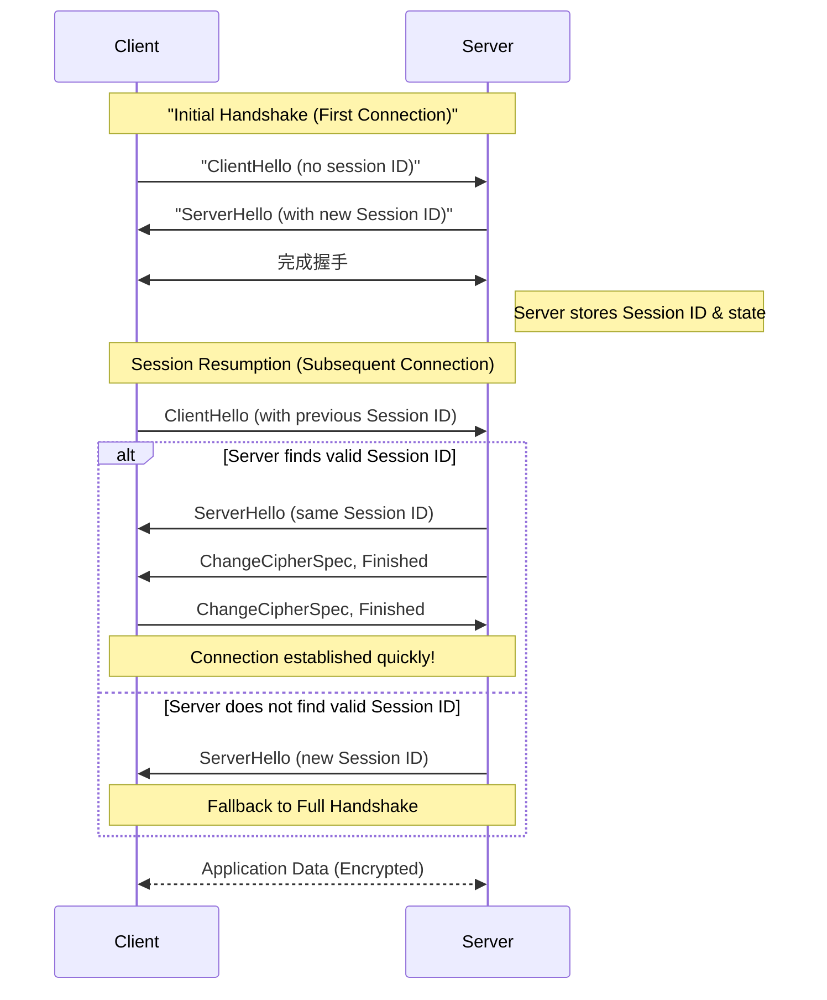

#### 首次握手：

- Server 會在 `ServerHello` 訊息中產生一個唯一的 `Session ID`。
    
- Server 內部將該 Session ID 與對應的 `master secret`、加密演算法等狀態資料綁定，儲存在快取中。
    

#### 恢復連線：

- Client 再次連線時，在 `ClientHello` 中攜帶該 Session ID。
    
- Server 若在快取中找到匹配且有效的 Session，即同意恢復連線。
    
- 雙方便可直接進行簡化握手（Abbreviated Handshake）流程，只需交換 `ChangeCipherSpec` 與 `Finished`，即可建立安全通道。
    

#### 缺點：

此方式要求 Server 儲存每個 Session 的狀態資訊。對於大型分散式架構（如多節點 Web 叢集）而言，會造成同步與快取管理上的負擔，不利於無狀態（stateless）服務部署。


### 二、Session Ticket（RFC 5077）

為了解決 Session ID 的狀態儲存問題，RFC 5077 引入了 **Session Ticket**，實現 **無狀態的連線恢復**（Stateless Session Resumption）。

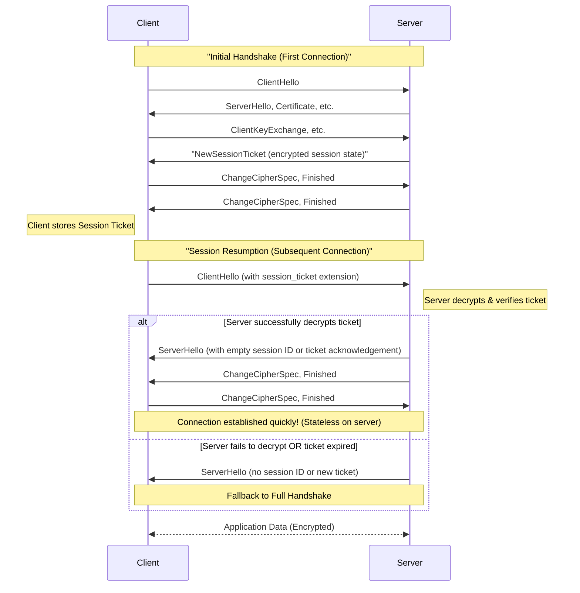

#### 首次握手：

- 握手時，Server 使用內部私鑰將整個會話狀態（例如 `master secret`、cipher suite 等）加密封裝成一個 Ticket。
    
- Server 透過 `NewSessionTicket` 訊息將該 Ticket 傳給 Client。
    
- 整個 Ticket 是一個 Server 加密後的 blob，Client 不需理解其內容。
    

#### 客戶端儲存：

- Client 將 Ticket 儲存起來，等待未來重連使用。
    

#### 恢復連線：

- Client 於之後的 `ClientHello` 訊息中，透過 `session_ticket` extension 附上該 Ticket。
    
- Server 收到後用自己的金鑰解密，若成功且 Ticket 有效，即還原出完整的會話狀態，繼續簡化握手。
    

#### 優點：

- Server 無需維護任何會話快取，所有狀態由 Client 攜帶。
    
- 非常適合分散式部署與負載平衡場景。
    

#### 缺點：

- `NewSessionTicket` 訊息是在 TLS 1.2 完整握手的末端明文傳送的。
    
- 如果 Server 私鑰洩漏，攻擊者可解密 Ticket，取得 `master secret`，進而離線解密 TLS 封包。
    
- 為了避免 Ticket 長期有效造成風險，實務上應搭配 key rotation 與過期機制。


## 預共享金鑰（Pre-Shared Key, PSK）

除了使用憑證進行身份驗證，TLS 1.2 也支援透過 **預共享金鑰（PSK）** 的方式來建立安全通道，定義於 [RFC 4279](https://datatracker.ietf.org/doc/html/rfc4279)。此方式不依賴公開金鑰基礎設施（PKI），特別適用於無法部署憑證或運算資源有限的環境，例如 IoT 裝置。

### PSK 模式分類

TLS 1.2 中的 PSK 可搭配不同金鑰交換方法，分為以下幾種套件形式：

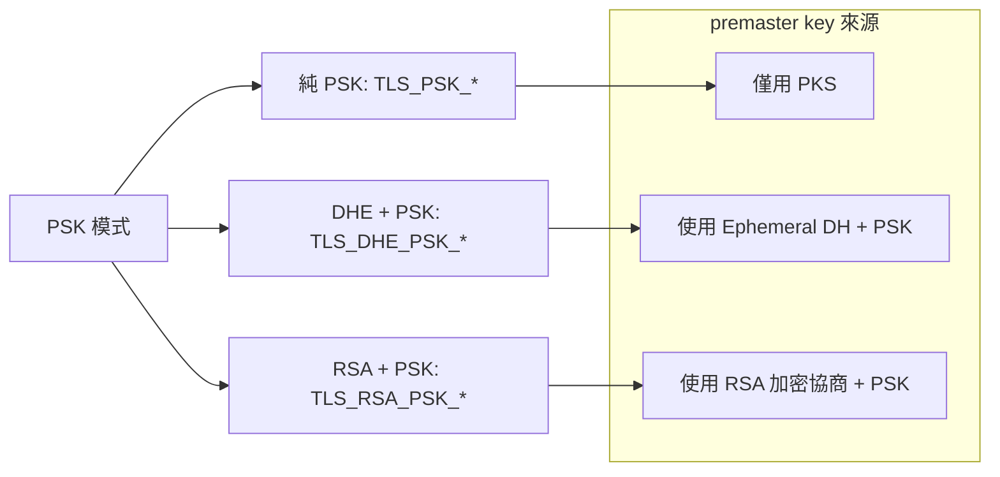

#### 1. 純 PSK 模式 (`TLS_PSK_*`)

- **完全不使用憑證**。
    
- 雙方預先協議一組對稱金鑰（PSK）。
    
- 握手期間，PSK 直接或間接作為 premaster secret 使用。
    
- **缺點**：不具 forward secrecy（前向保密性），若 PSK 洩漏，歷史封包亦可解密。
    

#### 2. 混合模式（`TLS_DHE_PSK_*`, `TLS_RSA_PSK_*`）

- **使用 DHE 或 RSA 執行金鑰交換流程**。
    
- PSK 並非直接作為 key，而是作為額外輸入參與 `master secret` 派生。
    
- 優點：可結合 PSK 的低成本與公開金鑰交換的前向保密性。
    
- 使用場景如：需提供 fallback 連線、支援雙向身份驗證，或封閉型專網。
    


## 小結

至此，我們已全面了解 TLS 1.2 的握手流程、Session Resumption 技術與 PSK 驗證方式。這些機制設計皆在平衡 **安全性**、**效能** 與 **可擴展性**，但也有其潛在風險與限制。

在[下一篇文章](https://blog.louisif.me/posts/understanding-tls-1-3-key-exchange-and-handshake/)中，我們將深入探討 **TLS 1.3** 對這些機制的重大改進與重新設計，包含：

- 更簡潔的握手流程
    
- 預設前向保密性
    
- 統一與強化的 PSK/Session 機制
    
- 加密的 SNI 與握手內容保護（Encrypted Client Hello）
    
## 參考文章
+ [RFC 4279 - Pre-Shared Key Ciphersuites for Transport Layer Security (TLS)](https://datatracker.ietf.org/doc/html/rfc4279)
+ [RFC 5077 - Transport Layer Security (TLS) Session Resumption without Server-Side State](https://datatracker.ietf.org/doc/html/rfc5077)
+ [RFC 5246 - The Transport Layer Security (TLS) Protocol Version 1.2](https://datatracker.ietf.org/doc/html/rfc5246#ref-TLSPSK)
