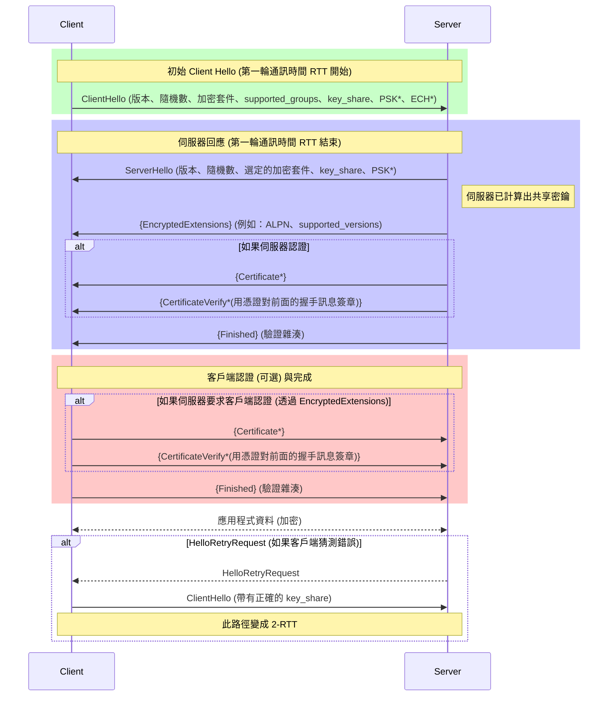
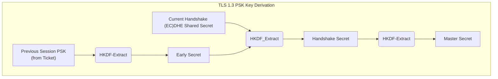

---
categories:
  - Networking
description: 接續前一篇對 TLS 1.2 的探討，本文將深入解析 TLS 1.3 的重大演進。我們將了解其如何透過簡化交握流程、移除過時算法與強化連線恢復機制，打造更快、更安全的次世代網路傳輸協定。
tags:
  - TLS
  - HTTPS
  - 網路協定
  - 資安
date: 2025-06-28
title: 搞懂 TLS 1.3：更快、更安全的次世代傳輸層安全協定
draft: false
---

在上一篇文章《[搞懂 TLS 1.2 金鑰交換原理與握手](https://blog.louisif.me/posts/understanding-tls-1-2-key-exchange-and-handshake)》中，我們已經對 TLS 1.2 的運作原理有了全面的了解。本文將以此為基礎，深入探討 TLS 1.3 帶來的改變。TLS 1.3 是一次大幅度的重新設計，解決了許多歷史遺留的安全性問題。

## 移除過時與不安全的元素

TLS 1.3 的核心設計理念之一是「化繁為簡，預設安全」。它首先做的，就是果斷地移除所有在 TLS 1.2 中被視為脆弱或不推薦的加密算法與功能，大幅縮小了攻擊面。

* **對稱加密**：徹底告別 RC4 和所有 CBC 模式的加密算法。只保留具備**認證加密（AEAD）** 特性的算法，例如 `AES-GCM` 和 `ChaCha20-Poly1305`，從根本上杜絕了 Padding Oracle 等針對 CBC 的攻擊。
* **金鑰交換**：移除了靜態 RSA 與靜態 DH 金鑰交換。只保留支援**向前保密性（Forward Secrecy**的臨時金鑰交換方案（DHE 和 ECDHE），確保即使伺服器私鑰洩漏，過去的通訊內容依然安全。
* **雜湊與金鑰衍生**：用於金鑰衍生的偽隨機函數（PRF）被更現代、更安全的 **HKDF（HMAC-based Extract-and-Expand Key Derivation Function）** 取代。
* **數位簽章**：新增 `EdDSA`（如 `ed25519` 和 `ed448`）等現代橢圓曲線簽章演算法，提供更高效能與更高安全性。
* 其他移除項目：
	* 完全移除了**壓縮功能**，以防止 CRIME、BREACH 等利用壓縮進行的攻擊。
	* 移除了有安全疑慮的**重新協商（Renegotiation）功能**。

## 加密套件的革命：化繁為簡

在 TLS 1.2 中，一個加密套件（Cipher Suite）定義了金鑰交換、身份驗證、對稱加密和 MAC 四個部分，組合非常複雜。TLS 1.3 對其語意進行了徹底的簡化。

現在，Cipher Suite **只定義「對稱加密算法（AEAD）」和「用於 HKDF 的雜湊函數」**。金鑰交換（如 ECDHE）和數位簽章（如 RSA、ECDSA）則被分離到獨立的擴展（extensions）中進行協商。

這樣的改變使得加密套件的數量從數十種銳減到僅有五種標準化的組合：

| 加密套件名稱 (Description)         | 值 (Value)    |
| ------------------------------------ | ------------- |
| `TLS_AES_128_GCM_SHA256`             | `{0x13,0x01}` |
| `TLS_AES_256_GCM_SHA384`             | `{0x13,0x02}` |
| `TLS_CHACHA20_POLY1305_SHA256`       | `{0x13,0x03}` |
| `TLS_AES_128_CCM_SHA256`             | `{0x13,0x04}` |
| `TLS_AES_128_CCM_8_SHA256`           | `{0x13,0x05}` |

## 交握流程再進化：從 2-RTT 到 1-RTT

接著整個連線建立的流程也有大幅的修改。在 TLS 1.2 中，一次完整的交握被稱為 **2-RTT**，意味著需要兩次網路往返（Round-Trip Time）才能建立連線：第一次往返用於 Hello 訊息與加密套件的協商，第二次往返則用於金鑰交換。

> 一個 RTT 不意味著雙方只發送一個封包，其重點在於「等待」。以 Client 的視角來看，它發出 `ClientHello` 後，必須等到 Server 回應 `ServerHelloDone` 訊息，才能繼續後續的動作。這整個「發送 -> 等待 -> 收到回應」的過程就是一個 RTT。

TLS 1.3 透過大膽的流程重構，將其縮減為**一次往返（1-RTT）**，顯著降低了建立連線的延遲。

為了實現 1-RTT，TLS 1.3 的做法是讓 Client 變得更「積極主動」：

1.  **推測性金鑰交換**：在 TLS 1.2 中，Client 需等待 Server 確認金鑰交換算法後，才會在第二輪通訊中發送自己的公鑰。在 TLS 1.3 中，Client 會在第一個 `ClientHello` 訊息裡，透過 `supported_groups` 擴展列出自己支援的 (EC)DHE 演算法參數（如橢圓曲線 `secp256r1`），並**推測** Server 可能會選擇的參數，直接在 `key_share` 擴展中附上對應的 (EC)DHE 臨時公鑰。

> supported_groups 擴展在 TLS 1.2 早期叫做 elliptic_curves，用來協商 ECDHE 具體使用的橢圓曲線參數。後來在 RFC 7919 中，變更為 supported_groups。Finite Field DHE (FFDHE) 指的是基於質數計算的 FFDHE，通常我們說 DHE 時，指代的是 FFDHE，透過 supported_groups 除了協商 ECDHE 使用的曲線外，也可以協商 FFDHE 使用的參數長度，比如 ffdhe2048。

2.  **成功情境**：如果 Server 支援 Client 推測的金鑰交換演算法和參數，它就會在 `ServerHello` 中也附上自己的 `key_share`，此時雙方立刻就能計算出共享密鑰，金鑰交換在一個來回內完成！

3.  **失敗情境**：如果 Client「猜錯了」，Server 會回覆一個 `HelloRetryRequest` 訊息，告知自己選擇的金鑰交換演算法和參數，要求 Client 重新發送一個帶有正確 `key_share` 的 `ClientHello`。這種情況下交握時間會退化為 2-RTT。

### 盡早加密：預設的隱私保護
 在 TLS 1.2 中，`ServerHello` 之後的伺服器憑證（Certificate）等訊息都是**明文傳輸**的。而在 TLS 1.3 中，一旦 Server 送出 `ServerHello`，後續所有交握訊息（包括伺服器憑證、擴展等）都會被加密在 `EncryptedExtensions` 中，大大增強了隱私性。

## 為了相容而生的巧思

TLS 1.3 的改動如此巨大，如何在充滿老舊設備的網路上順利部署？為此，TLS 1.3 採用了巧妙的「偽裝」策略來應對：

* **偽裝版本號**：TLS 1.3 的 `ClientHello` 封包中，`legacy_version` 欄位會被設為 `0x0303`（即 TLS 1.2）。而真正支援的版本列表則放在 `supported_versions` 這個擴展中。雖然欄位名稱叫做 `legacy_version` 但實際編碼成二進位後，`legacy_version` 和原本的 `version` 欄位是同樣的，只是名稱上不同。

>  RFC 中提到，這麼做的原因是許多老舊的伺服器或網路中介設備（Middleboxes）實現沒有正確實作版本協商的功能，進而無法正確處理未知的 TLS 版本號。如果 Client 直接宣告 1.3 版，這些設備可能會直接中斷連線，造成「版本不容忍」（Version Intolerance）問題。

+ **格式兼容**：雖然 TLS 1.3 有許多改動的部分，但這些改動的內容都被移動到 extension 中，TLS 1.3 的 `ClientHello` 格式是完全符合的 `ClientHello`。對一個只支援到 TLS 1.2 的設備，完全可以降級到 TLS 1.2 完成握手。

> 為了避免降級攻擊，TLS 1.3 有專門設計的降級保護機制。降級攻擊是透過某些手段讓伺服器和客戶端協商決定使用較舊存在漏洞的 TLS/SSL 版本。比如阻斷 client 使用 TLS 1.3 握手的封包，那 Client 可能就會嘗試使用較舊的版本握手。支援 TLS 1.3 的 server 發現客戶端決定使用較舊的 TLS 版本 (TLS 1.2 或更早) 時，會將 ServerHello 的 random number 的末幾位填成一個固定值，client 發現 random number 包含這個固定值，就知道 server 其實是支援 TLS 1.3 的，失敗是因為有外部影響。又因為 random number 被 TLS 握手本身機制保護，所以也不可能被篡改。

* **模擬舊流程**：為了欺騙那些嚴格檢查 TLS 1.2 流程的中介設備，TLS 1.3 的交握過程會發送一些無意義的虛擬封包，例如 `ChangeCipherSpec`，並在 `session_id` 欄位填入隨機值，使其看起來更像一個標準的 TLS 1.2 流程，從而避免被錯誤地阻擋。

## PSK、連線恢復與 0-RTT：兼顧效能與安全

TLS 1.3 另外一個重大改變是，重新設計了連線恢復機制，將 TLS 1.2 的 Session ID 和 Session Ticket 統一整合到一個更安全、更強大的**預共享金鑰（PSK）**框架中，並徹底解決了先前版本中 Session Ticket 缺乏向前保密性的問題。

在介紹 TLS 1.2 PSK 時有說明，因為雙方會直接使用 PSK 作為 premaster secret，所以如 PSK 外洩，就可以解密所有歷史封包。

### 具備向前保密性的連線恢復

在 TLS 1.3 中，當一次成功的完整交握結束後，Server 會發送 `NewSessionTicket` 給 Client，這個 Ticket 就被視為一個 PSK。

當 Client 希望恢復連線時：
1.  它在 `ClientHello` 中同時提供 PSK（來自 Ticket）和一個**新的**臨時公鑰（在 `key_share` 擴展中）。
2.  Server 驗證 PSK 後，也會提供一個**新的**臨時公鑰。
3.  最終的會話金鑰，是由 **PSK** 和**本次新的 (EC)DHE 交換結果**，兩者一同經過 HKDF 混合衍生出來的。

因此在這個架構下，即使攻擊者竊取了用於加密 Ticket 的伺服器金鑰並解出了 PSK，但由於缺乏當次連線臨時生成的 (EC)DHE 私鑰，他依然無法計算出最終的會話金鑰。

### 0-RTT：零往返時間恢復

在 PSK 的基礎上，TLS 1.3 還引入了 **0-RTT（Zero Round Trip Time Resumption）**。Client 可以在發送第一個 `ClientHello` 的同時，就使用 PSK 衍生的金鑰加密第一批應用數據（Early Data）並透過 early_data extension 發送出去。

#### 0-RTT 的風險：重放攻擊（Replay Attack)
 0-RTT 提升了效能，但也帶來了嚴重的安全隱患。由於 Server 在收到 0-RTT 數據時，尚未完成完整的交握來驗證 Client 的唯一性，攻擊者可以取得這批加密封包並多次發送給伺服器。

> 在 TLS 內部也具有 seqence number 機制，會記錄當前傳輸到第幾個 TLS 封包，並加入到封包的 MAC 計算中，所以一般的 TLS 連線可以防禦 replay attack。對 0-RTT 而言，攻擊的永遠是第一個封包所以 seqence number 機制無法防禦。

 一個用於扣款的 API 請求若以 0-RTT 發送，攻擊者重放該請求就可能導致用戶被重複扣款。因此，0-RTT **只適用於那些被重放也無害的請求**（如冪等的 GET 請求），應用程式層可以透過 `Early-Data: 1`，來確認這是一個 0-RTT requets，謹慎處理。抑或是伺服器可以實現 One-Shot Tickets，發行只能使用一次的 Session Ticket，但對於現在的多伺服器架構而言，實現跨伺服器的同步會有額外的困難。

## Encrypted Client Hello

TLS 1.3 成功讓 TLS 變得更加安全與隱私，但仍存在一個重大的隱私漏洞，那就是附屬在 `ClientHello` 中的 Server Name Indication（SNI）。SNI 的功能是讓伺服器知道用戶端要連線的主機名稱，對於同時服務多個域名的伺服器而言，才能正確地載入對應的主機設定檔來處理請求。但這也意味著，**用戶端所訪問的主機名稱會以明文形式暴露在網路上**，成為潛在的隱私洩漏點。

最初提出的解法是 **ESNI（Encrypted SNI）**。簡單來說，ESNI 利用 DNS 記錄中的公鑰加密 SNI，並將其封裝在 `encrypted_sni` 擴充欄位中，同時搭配 DoH（DNS over HTTPS）來加密 DNS 查詢，藉此防止外部觀察者得知用戶實際欲連線的主機名稱。

然而，ESNI 遇到了多項實務上的挑戰：例如特徵明顯，容易被偵測出正在使用 ESNI；公鑰透過 DNS 傳遞存在快取與同步問題；此外，ESNI 僅加密 SNI，`ClientHello` 其他欄位仍為明文，且一旦解密失敗，連線就無法繼續建立。

![[understanding-tls-1-3-key-exchange-and-handshake-1750351514981.png]]

因此，目前主流方向是改採 **Encrypted Client Hello（ECH）**。ECH 相較於 ESNI 更進一步，**直接將整個 `ClientHello` 加密後，封裝在另一個外層的 `ClientHello` extension 中**。外層 `ClientHello` 看起來就像是正常的封包，避免了明顯的特徵暴露。

不過，ESNI 與 ECH 在實作上仍有許多細節與技術挑戰，包括密鑰分發、兼容性處理、回退機制等，這些部分本文暫不深入討論。

## 小結

TLS 1.3 無疑是網路安全領域的一次巨大飛躍。它透過移除不安全的老舊設計、簡化加密套件、將交握流程最佳化至 1-RTT，並提供具備向前保密性的連線恢復機制，為我們帶來了更快速、更安全的網路體驗。雖然 0-RTT 等新功能引入了新的挑戰，但整體而言，TLS 1.3 為未來十年網路傳輸安全奠定了堅實的基礎。

## 參考文章
[RFC 8446 - The Transport Layer Security (TLS) Protocol Version 1.3](https://datatracker.ietf.org/doc/html/rfc8446)
[RFC 5246 - The Transport Layer Security (TLS) Protocol Version 1.2](https://datatracker.ietf.org/doc/html/rfc5246)
[How does TLS 1.3 protect against downgrade attacks? \| The blog of a gypsy engineer](https://blog.gypsyengineer.com/en/security/how-does-tls-1-3-protect-against-downgrade-attacks.html)
https://www.cloudflare.com/zh-tw/learning/ssl/what-is-encrypted-sni/
[伺服器名稱指示 - 維基百科，自由的百科全書](https://zh.wikipedia.org/zh-tw/%E6%9C%8D%E5%8A%A1%E5%99%A8%E5%90%8D%E7%A7%B0%E6%8C%87%E7%A4%BA#%E5%8A%A0%E5%AF%86%E6%9C%8D%E5%8A%A1%E5%99%A8%E5%90%8D%E7%A7%B0%E6%8C%87%E7%A4%BA)